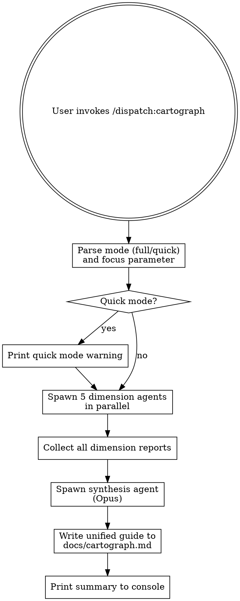

# Cartograph

Parallel codebase mapper and developer guide generator. Five dimension specialists analyze the project's structure, data flow, conventions, infrastructure, and domain logic. Output: unified developer guide with architecture map, data flow narrative, conventions reference, infrastructure guide, and domain glossary.

## Invocation

```
/dispatch:cartograph                  # Full analysis, all dimensions
/dispatch:cartograph quick            # Quick scan (all Sonnet, 15-file cap per agent)
/dispatch:cartograph focus:auth       # Focus all dimensions on auth subsystem
/dispatch:cartograph focus:api quick  # Focus + quick mode
```

## Agent Roster

| Agent | Lens | Model | Reading Strategy |
|-------|------|-------|------------------|
| Structure | Module boundaries, entry points, dependency graph, file organization | Opus | Imports, package config, directory layout, build manifests |
| Data Flow | Data movement: APIs, state, storage, transformations, middleware chains | Opus | Function calls, DB queries, API routes, data handlers |
| Conventions | Naming patterns, code style, idioms, error handling, testing patterns | Sonnet | Broad file sampling, style consistency, pattern detection |
| Infrastructure | Build, deploy, CI/CD, env vars, external services, containers | Sonnet | Config files, scripts, pipeline definitions, Dockerfiles, manifests |
| Domain | Business logic, key entities, workflows, domain vocabulary, core abstractions | Sonnet | Source files, test descriptions, docs, comments, domain model |

### Model Strategy

- **Opus**: Structure, Data Flow — require sustained analysis, complex dependency tracking
- **Sonnet**: Conventions, Infrastructure, Domain — pattern matching, file sampling
- **Quick mode override**: All agents use Sonnet. Token cap 15 files per agent. Prints warning: "Quick mode used Sonnet for all dimensions. Structure and Data Flow analysis may miss subtle dependency chains — manual review recommended for complex systems."

## Execution Flow



## Step-by-Step Protocol

### Step 1: Parse Input

Extract from user input:
- **Mode**: `full` (default) or `quick`
- **Focus parameter**: `focus:subsystem` (optional, e.g., `focus:auth`, `focus:api`)

If focus parameter provided, add to each agent prompt: "**Focus your analysis on the {focus} subsystem.** Ignore files and modules outside this scope. Only report findings related to {focus}."

### Step 2: Print Warning if Quick Mode

If mode is `quick`, print before dispatch:

```
⚡ Quick mode: all agents use Sonnet with 15-file exploration limit.
   Structure and Data Flow analysis may miss subtle dependency chains.
   Manual review recommended for complex systems.
```

### Step 3: Dispatch Dimension Agents

Spawn all 5 agents **in parallel** using the Agent tool. Set `model` parameter per roster table above.

**Quick mode override**: Set `model: "sonnet"` for all agents, add to each prompt: "TOKEN BUDGET: Limit exploration to 15 files. Prioritize breadth over depth. Report top 10 findings per dimension."

#### Agent Prompt Template

Each agent receives this prompt (fill in `{DIMENSION}`, `{LENS}`, `{READING_STRATEGY}`):

---

**BEGIN AGENT PROMPT**

You are a codebase analyst specializing in {DIMENSION}. Your goal is to map this dimension of the project and report findings that will help developers understand, navigate, and work within this system.

**Your lens**: {LENS}

**Your reading strategy**: {READING_STRATEGY}

**Output style**: Informational and accurate. No opinions, no criticism. Report what exists and why it matters for understanding this dimension.

**Task**:
1. Explore the project within your dimension. Read files, check structure, understand patterns.
2. Identify key findings that help developers understand this dimension.
3. Tag each finding with **importance**:
   - **Critical**: Essential to understand the dimension. Developers must know this.
   - **Important**: Valuable context. Helps navigation and mental models.
   - **Notable**: Interesting pattern or convention worth documenting.
4. For each finding, provide:
   - What it is (one sentence)
   - Where it lives (file path or project-wide)
   - Why it matters for understanding this dimension (one sentence)
5. Be thorough within your dimension. Miss nothing major.

**Output format**:

```
## {DIMENSION} Analysis

### Key Findings

#### [CRITICAL] Short title
- **What**: One sentence describing what this is
- **Where**: path/to/file or project-wide
- **Why it matters**: One sentence explaining significance

#### [IMPORTANT] Short title
...

### Notable Patterns
[List notable patterns, conventions, or design choices in this dimension]

### Cross-dimension Notes
[Any observations that bridge to other dimensions — data flow impacts, infrastructure constraints, etc.]
```

**END AGENT PROMPT**

---

#### Domain Agent Supplement

The Domain agent receives the standard prompt above **plus** these additional instructions appended:

---

**BEGIN DOMAIN SUPPLEMENT**

**Domain Model Discovery**

Before mapping business logic and workflows, identify the core domain model:

1. **Read docs**: Look for any domain docs, glossary, or business logic documentation
2. **Check tests**: Read test descriptions for clues about workflows, entities, and expected behavior
3. **Examine comments**: Core entities often have domain-specific comments explaining their purpose
4. **Map entities**: Identify the main entities (User, Order, Account, etc.) and their relationships

**Key Entities to Document**: For each core entity, document:
- What it represents (one sentence)
- Key fields/properties
- Main relationships to other entities
- Where it is defined and used

**Domain Workflows**: Identify 3-5 key workflows (e.g., "User signup flow", "Payment processing", "Report generation"). For each:
- What business process does it execute?
- Which entities are involved?
- What side effects occur (DB writes, API calls, notifications)?
- Where is it implemented?

**END DOMAIN SUPPLEMENT**

---

### Step 4: Synthesis

After all agents return, spawn one final **synthesis agent** (`model: "opus"`) that merges dimension reports into a unified developer guide.

#### Synthesis Agent Prompt

---

**BEGIN SYNTHESIS PROMPT**

You are a technical writer synthesizing codebase analysis from 5 specialist agents. Your job is to produce a unified, navigable developer guide that helps any developer understand and work effectively in this project.

**Input**: Five dimension analysis reports (Structure, Data Flow, Conventions, Infrastructure, Domain). Merge them into one coherent guide.

**Output structure**:

```markdown
# Developer Guide — {Project Name}

## Project Overview
[One paragraph: What does this project do? Who uses it? What problem does it solve?]

## Architecture Map
[From Structure agent: Module layout, entry points, major dependencies, file organization. Include a simple text diagram if helpful.]

## Data Flow Narrative
[From Data Flow agent: How data moves through the system. Key APIs, database operations, state management patterns. Organized by major workflow.]

## Key Entities & Domain Model
[From Domain agent: Core entities, relationships, domain vocabulary. Simple ASCII diagrams or lists of relationships.]

## Conventions & Patterns
[From Conventions agent: Naming conventions, code style, error handling, testing patterns. What should new developers know to write consistent code?]

## Infrastructure & Deployment
[From Infrastructure agent: Build process, test/deploy pipeline, environment setup, external services, containers. How is this project built, tested, and deployed?]

## Complexity Assessment

| Dimension | Complexity | Notes |
|-----------|------------|-------|
| Structure | simple/moderate/complex | [brief rationale] |
| Data Flow | simple/moderate/complex | [brief rationale] |
| Domain | simple/moderate/complex | [brief rationale] |
| Conventions | simple/moderate/complex | [brief rationale] |
| Infrastructure | simple/moderate/complex | [brief rationale] |

## Getting Started Checklist
- [ ] Clone repo and understand directory structure
- [ ] Read domain glossary and understand core entities
- [ ] Run build/test commands — understand the pipeline
- [ ] Walk through a major workflow in code
- [ ] Check naming conventions and write a small test

## Gotchas & Non-obvious Patterns
[Anything that surprised the agents or contradicts common patterns in its class of projects]

## Cross-dimension Links
[Where dimensions intersect: e.g., "Infrastructure constraints affect Data Flow patterns in the cache layer"]

---

[Include full merged reports from all agents below for reference]

## Raw Dimension Reports

### Structure Analysis
[Full Structure agent output]

### Data Flow Analysis
[Full Data Flow agent output]

### Conventions Analysis
[Full Conventions agent output]

### Infrastructure Analysis
[Full Infrastructure agent output]

### Domain Analysis
[Full Domain agent output]
```

**Merge rules**:
1. Prefer clarity over completeness. If an agent finding is redundant with another, merge them.
2. Link related findings across dimensions. E.g., if Data Flow mentions a cache pattern and Infrastructure describes cache config, reference both.
3. Highlight any dimension that stands out (e.g., "exceptionally complex infrastructure, consider starting with that section").
4. If a dimension is notably simple/empty, note it (e.g., "Infrastructure is minimal — this is a single-service deployment").

**END SYNTHESIS PROMPT**

---

### Step 5: Write Output

1. **File**: Write the full unified guide to `docs/cartograph.md` in the target project. Overwrite if it already exists (no versioning, no counters).
2. **Console**: Print summary with project name, complexity assessment, and line count of guide produced.

#### Console Summary Format

```
═══════════════════════════════════════════════
  CARTOGRAPH — Developer Guide Generated
═══════════════════════════════════════════════

  Project: {Project Name}
  File: docs/cartograph.md ({N} lines)

  COMPLEXITY ASSESSMENT:
    Structure:      {simple|moderate|complex}
    Data Flow:      {simple|moderate|complex}
    Conventions:    {simple|moderate|complex}
    Infrastructure: {simple|moderate|complex}
    Domain:         {simple|moderate|complex}

  Dimension Highlights:
    • Structure: {one notable finding}
    • Data Flow: {one notable finding}
    • Domain: {one notable finding}

  Guide written to: docs/cartograph.md
═══════════════════════════════════════════════
```

### Step 6: Design Doc Persistence (Optional)

After writing the guide to `docs/cartograph.md`, offer to persist as a project design doc:

```
Save as project design doc? This makes findings available to future agents
and implementation sessions.
  → docs/designs/cartograph-{slug}-YYYY-MM-DD.md
```

**If accepted**:
1. Read the unified developer guide from `docs/cartograph.md`
2. Copy the full guide to `docs/designs/cartograph-{slug}-YYYY-MM-DD.md` where `{slug}` is kebab-cased project name extracted from guide header
3. Add frontmatter:
   ```yaml
   ---
   purpose: "Developer guide and architecture map for {Project Name}"
   source-skill: cartograph
   date: YYYY-MM-DD
   status: draft
   ---
   ```
4. Strip ephemeral content (console formatting, timestamps, agent attribution in raw reports section)
5. Create `docs/designs/` directory if it doesn't exist
6. On first `docs/designs/` creation in this project, append to project CLAUDE.md:
   ```markdown
   ## Design Docs

   When orienting (switch-in, dian, or starting any session), read all files in `docs/designs/`. These contain decisions, analyses, and strategic plans that inform future work.
   ```
   - Existence check: Grep CLAUDE.md for `## Design Docs` first. If it exists, skip injection.
   - If CLAUDE.md doesn't exist, create it with just this block.
   - If write fails, warn and continue (best-effort).

**If declined**, skip silently.

## Failure Modes & Edge Cases

| Failure | Behavior |
|---------|----------|
| Empty project | All agents report immediately. Guide notes "This project has no code. Guide cannot be generated." |
| Single-file project | All agents run normally. Guide structures findings around single file. |
| Monorepo (multiple entry points) | Dimension agents read all entry points. Structure agent documents multiple roots. Guide notes polyrepo structure in overview. |
| Focus parameter matches no files | Warning: "Focus parameter '{focus}' matched no files. Running analysis on entire project." Skip focus filter. |
| Agent timeout or crash | Skip that agent. Synthesis notes "Agent X did not return findings — dimension incomplete." Omit that section from guide. |
| Write to docs/ fails | Print full guide to console. Warn: "Could not write to docs/cartograph.md — guide printed to console only." |
| All agents return empty | Synthesis generates skeleton guide with "No findings in dimension X" placeholders. Flag as suspicious in summary. |

## Edge Cases

- **Empty project**: Report it. "This project contains no code. Cartograph cannot generate a guide without code."
- **Single-file project**: Run all agents. Even minimal projects have structure, conventions, and domain logic worth documenting.
- **No prior history**: Cartograph is stateless. Each run is fresh analysis.
- **Read-only project**: Skill functions normally (agents only read). File write to `docs/` may fail — see Failure Modes table.
- **Partial file access**: If filesystem access is restricted, agents explore what they can. Synthesis notes incomplete analysis in guide.

## Agent Context & Invocation

When spawning each dimension agent via the Agent tool:

```
Agent({
  description: "{DIMENSION} analysis",
  model: "opus",  // or "sonnet" per roster
  prompt: "... full agent prompt ..."
})
```

Each agent inherits the current working directory. They have full filesystem access to the target project via **Read, Glob, and Grep tools only**. No Bash, no WebSearch, no file modifications.

**What agents can use**: Read, Glob, Grep
**What agents must NOT do**: Bash, WebSearch, Write, Edit. They are analysts, not operators or researchers.

## Output Format

Single file: `docs/cartograph.md` (created/overwritten, not versioned)

Contents:
- Project overview (1 paragraph)
- Architecture map (Structure dimension)
- Data flow narrative (Data Flow dimension)
- Key entities & domain model (Domain dimension)
- Conventions & patterns (Conventions dimension)
- Infrastructure & deployment (Infrastructure dimension)
- Complexity assessment table
- Getting started checklist
- Gotchas & non-obvious patterns
- Cross-dimension links
- Raw dimension reports (appendix)

No timestamp, no history, no TODO integration. Cartograph is stateless — each run replaces the prior output.

## Kerd Integration

Dispatch works standalone but integrates with the [Kerd](https://github.com/KwanwooLee36/kerd) ecosystem when available.

Cartograph guides can be persisted to project vault via `/kerd:kivna save`:

- Latest cartograph.md snapshot
- Snapshot timestamp
- Complexity assessment as structured data

This allows tracking how project complexity evolves over time across sessions.
