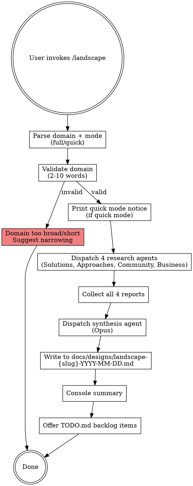

# Landscape

Domain and market research survey. Spawns parallel research agents across four dimensions (solutions, approaches, community, business), synthesizes into landscape map, comparison matrix, and opportunity ranking.

## Invocation

```
/landscape "real-time collaboration tools"     # Full mode — 4 agents, 5-10 searches each
/landscape quick "state management"             # Quick mode — 4 agents, 3-5 searches each
/landscape                                      # Interactive — prompts for domain
```

## Input Parsing

**Domain string**: User provides a domain/topic to research (e.g., "real-time collaboration", "state management for React", "database migration tools").

**Validation rules**:
- Length: 2-10 words. Reject strings with <2 or >10 words.
- Overly broad domains (>10 words or keywords like "technology", "software"): Warn and suggest narrowing.
  - Example: `❌ "technology"` → "Too broad. Try: 'web framework', 'CSS-in-JS solution', 'real-time database'"
- Valid input: `✓ "real-time collaboration tools"`, `✓ "state management"`, `✓ "database migration"`.

**Mode parsing**: If user provides `quick` before or after domain string, use quick mode. Otherwise default to full mode.

**No codebase dependency**: Landscape works anywhere — empty directory, nested project, no special setup required.

## Research Agents

Four parallel agents, one per dimension. Each receives identical domain input plus its specialist focus.

### Model Strategy

| Mode | Model | Dispatch |
|------|-------|----------|
| Full | sonnet | 4 agents in parallel (solutions, approaches, community, business) |
| Quick | sonnet | 4 agents in parallel (same agents, token-capped prompts) |

All Sonnet in both modes.

**Quick mode additions**: Add to each agent prompt:
```
TOKEN BUDGET: Keep research to 3-5 WebSearches maximum. Prioritize breadth over depth. 
Report top findings only. Aim for coverage, not exhaustive analysis.
```

### Tools

- **WebSearch** — primary discovery (find products, tools, blog posts, discussions, funding news)
- **WebFetch** — deep reads of product pages, docs, GitHub READMEs
- **Read, Glob, Grep** — read target project for optional context (if cwd contains code)
- **No Bash** — research only, no execution

### Agent 1: Solutions

**Description**: "Existing tools, products, libraries, SaaS solutions, frameworks"

**Focus**: Catalog what's available in the domain. For each solution, report: name, category, positioning, key features, pricing model, maturity signals, community size, open source status.

**Search strategy (5-10 in full, 3-5 in quick)**:
- Direct searches: "{domain} tools", "{domain} solutions", "{domain} alternatives"
- Platform-specific: "npm {domain}", "GitHub {domain}", "ProductHunt {domain}"
- Vendor-neutral comparison: "{domain} comparison", "{domain} vs"
- Recent/trending: "{domain} 2026", "{domain} latest"

**Output format**:
```
## Solutions Landscape

### [Solution Name]
- **Category**: [Type of tool]
- **Positioning**: One sentence — what problem it solves
- **Key features**: Bullet list (3-5 top features)
- **Pricing**: Free / Freemium / Paid / Open source
- **Maturity signals**: GitHub stars (if OSS), company funding, adoption signals
- **Community**: Active / Growing / Stable / Declining

### [Next Solution]
...
```

### Agent 2: Approaches

**Description**: "Technical patterns, architectural styles, research papers, design patterns, industry best practices"

**Focus**: Uncover the **how** — recurring technical approaches, design patterns, architectural trends, and research insights. Blog posts, academic papers, RFCs, architectural debates.

**Search strategy (5-10 in full, 3-5 in quick)**:
- Pattern research: "{domain} pattern", "{domain} architecture", "{domain} design"
- Industry discourse: "HackerNews {domain}", "Reddit r/programming {domain}"
- Academic: "{domain} research", "{domain} whitepaper", "{domain} academic"
- Best practices: "{domain} best practices", "{domain} lessons learned", "{domain} gotchas"
- Comparison/tradeoffs: "{domain} tradeoffs", "{domain} pros cons"

**Output format**:
```
## Technical Approaches

### [Approach/Pattern Name]
- **What it is**: Description of the approach
- **When to use**: Typical use cases
- **Tradeoffs**: Strengths and limitations
- **Adoption**: How widely used is this approach?
- **Sources**: Key blog posts, papers, or references

### [Next Approach]
...
```

### Agent 3: Community

**Description**: "Sentiment from Reddit, HackerNews, forums, Twitter/X, community discussions, common pain points, adoption sentiment"

**Focus**: What are practitioners saying? Pain points, satisfaction, trends, heated debates, sentiment shifts. Ground the research in real user experience.

**Search strategy (5-10 in full, 3-5 in quick)**:
- Reddit: "site:reddit.com {domain}", "r/programming {domain}", "r/webdev {domain}"
- HackerNews: "site:news.ycombinator.com {domain}", "{domain} discussion"
- Community forums: "{domain} forum", "{domain} community", "{domain} Discord"
- Sentiment: "{domain} problems", "{domain} criticism", "{domain} love/hate"
- Emerging trends: "{domain} 2026", "{domain} hype", "{domain} backlash"

**Output format**:
```
## Community Sentiment

### Adoption Sentiment
- [Positive signals]: [trends/quotes]
- [Concerns/pain points]: [common complaints]
- [Hype signals]: [trending discussion]

### Common Pain Points
- [Pain point]: [description, prevalence]

### Emerging Trends
- [Trend]: [what people are talking about]

### Overall Community Health
[Narrative on engagement, growth, sentiment trajectory]
```

### Agent 4: Business

**Description**: "Pricing models, company health, funding, adoption metrics, market leaders, competitive positioning, business sustainability"

**Focus**: Market dynamics — who's winning, who's struggling, pricing trends, funding signals, company health indicators, market consolidation.

**Search strategy (5-10 in full, 3-5 in quick)**:
- Company/funding: "{solution} funding", "{solution} Series", "{solution} IPO", "Crunchbase {domain}"
- Adoption: "{solution} adoption", "{solution} user count", "{solution} market share"
- Pricing research: "{solution} pricing", "{domain} pricing comparison"
- M&A/consolidation: "{domain} acquisition", "{domain} merger", "{domain} consolidation"
- Market reports: "{domain} market report", "{domain} industry analysis", Gartner/IDC

**Output format**:
```
## Business Landscape

### Market Leaders
- [Company/Product]: [Market position, strengths]

### Pricing Models
- [Model type]: [Examples, typical costs]

### Funding & Health
- [Company]: [Funding stage, recent news, trajectory]

### Market Dynamics
- [Consolidation/M&A]: [Activity, implications]
- [Emerging players]: [New entrants, disruption signals]
- [Sustainability signals]: [Revenue trends, adoption growth]
```

---

## Synthesis Agent

After all four research agents return, spawn one synthesis agent (`model: "opus"`) to merge and analyze all findings.

### Synthesis Agent Prompt

---

**BEGIN LANDSCAPE SYNTHESIS PROMPT**

You are a Domain Analyst. You have received research reports from four specialist agents on a domain. Your job is to synthesize these into actionable market intelligence.

**You have six jobs:**

#### Job 1: Landscape Map

Merge all solutions from the Solutions agent into a segmented taxonomy. Group by category or use case:
- List all solutions found
- Group by: Category, Target Audience, Maturity, or Price Point (pick the most natural grouping)
- For each group: characterize the segment

**Output format:**

```
## Landscape Map

### [Segment Name]
- [Solution Name] — [positioning] ([Key differentiator])
- [Solution Name] — ...

### [Next Segment]
...
```

#### Job 2: Comparison Matrix

Build a feature/attribute matrix comparing top 3-5 solutions (pick the most mature or market-leading ones):

| Feature | Solution A | Solution B | Solution C | Consensus |
|---------|-----------|-----------|-----------|-----------|
| Real-time sync | Yes | Yes | No | Table stake |
| Offline support | No | Yes | Yes | Emerging standard |
| Pricing | $X/mo | Open source | Free tier | Varies |
| Maturity | Mature | Growth | Early | Mixed |
| Community | 50K stars | Active | Small | Varies |

#### Job 3: Sentiment Summary

Synthesize community feedback from the Community agent:
- **Top praise**: What practitioners love most
- **Top complaints**: Recurring pain points
- **Market sentiment**: Is this domain hot? Cooling? Stabilizing?
- **Migration trends**: Are users moving between solutions? Why?

#### Job 4: Gap Analysis

Cross-reference all four dimensions:
- **Feature gaps**: Are there gaps across all solutions? What do practitioners say they want that doesn't exist?
- **Approach gaps**: Are there technical approaches mentioned in academia/research that no solution implements?
- **Community dissatisfaction**: Do community complaints correlate with missing features?
- **Market opportunity**: Are there segments or use cases underserved?

#### Job 5: Opportunity Ranking

Rank emerging opportunities (blue ocean spaces, unmet needs):

| Opportunity | Market Gap | Feasibility | Community Signal | Rank |
|------------|-----------|------------|-----------------|------|
| [Opportunity] | [Gap it fills] | Easy/Med/Hard | [Is community asking for this?] | 1 |

Rank by: (community signal × market gap) / feasibility. Be opinionated.

#### Job 6: Positioning Recommendations

If a team enters this space, how should they position? Based on gaps, sentiment, and competition:
- **Whitespace**: What positioning would differentiate from incumbents?
- **Underserved segment**: Which user type or use case is underserved?
- **Positioning statement**: Draft a one-sentence positioning for a new entrant.

#### Final Output

```markdown
## Landscape Map
[Segmented taxonomy]

## Comparison Matrix
[Feature/attribute table for top solutions]

## Community Sentiment
- **Top praise**: [findings]
- **Top complaints**: [findings]
- **Market temperature**: [hot/warm/cool]

## Gap Analysis
- **Feature gaps**: [across all solutions]
- **Approach gaps**: [research-to-practice gap]
- **Community dissatisfaction**: [unmet needs]
- **Market opportunity**: [underserved segments]

## Opportunity Ranking

| Opportunity | Gap | Feasibility | Community Signal | Rank |
|------------|-----|------------|-----------------|------|

## Positioning Recommendations

### Whitespace
[Unfilled competitive position]

### Underserved Segment
[User type or use case lacking solutions]

### Recommended Positioning
[Draft: "We are the [category] for [audience] who [need]"]
```

**Rules:**

1. Landscape Map must have clear grouping logic — don't just list. Explain the categories.
2. Comparison Matrix must be grounded in actual findings, not invented. If data is missing, note it.
3. Sentiment Summary must cite actual community observations, not assumptions.
4. Gap Analysis must connect dots across dimensions — solutions (what exists) + approaches (what's theoretically possible) + community (what people want) + business (what's viable).
5. Opportunity Ranking must be ranked, not a bulleted list. Provide rationale.
6. Positioning Recommendations must be grounded in gaps. Don't suggest vague positions.

**END LANDSCAPE SYNTHESIS PROMPT**

---

## Execution Flow



### Step 1: Parse and Validate Domain

1. **Parse**: Extract domain string and mode (`quick` or `full`).
2. **Validate**: Check domain string length:
   - If < 2 words: Error. "Domain too short. Provide 2-10 words (e.g., 'real-time collaboration')."
   - If > 10 words: Warn. "Domain string is long ({N} words). Consider narrowing to 2-10 words for better research focus. Proceed? (y/n)"
   - If user declines: Exit cleanly.
3. **Suggest narrowing** for overly broad domains:
   - Example input: `"technology"` → "❌ Too broad. Try: 'web framework', 'CSS-in-JS solution', 'message queue'."
   - Example input: `"database"` → "❌ Too broad. Try: 'time-series database', 'document store', 'graph database'."

### Step 2: Print Quick Mode Notice

If quick mode, print:
```
⚡ Quick mode: 3-5 searches per agent, breadth over depth.
```

### Step 3: Dispatch Research Agents

Print: `"Dispatching 4 research agents..."`

Spawn 4 agents in parallel (Solutions, Approaches, Community, Business) via the Agent tool. Each agent:
- Receives identical domain input
- Specialized prompt for its dimension
- Model: `sonnet`
- Tools: WebSearch, WebFetch, Read/Glob/Grep (optional project context)

If cwd contains code, agents can optionally read project context to understand related requirements.

### Step 4: Collect Reports

After all 4 agents return, concatenate their reports. If any agent failed or timed out, note which dimension has incomplete research. Proceed with synthesis using partial data.

### Step 5: Dispatch Synthesis Agent

Print: `"Synthesizing landscape analysis..."`

Spawn synthesis agent:
```
Agent({
  description: "landscape: synthesize domain research",
  model: "opus",
  prompt: "... synthesis prompt with all 4 agent reports concatenated ..."
})
```

### Step 6: Write Report

Write the full synthesis output to `docs/designs/landscape-{slug}-{DATE}.md`:
- **DATE**: `YYYY-MM-DD`
- **slug**: Kebab-cased domain string. Example: `"real-time collaboration"` → `landscape-real-time-collaboration-2026-05-08.md`

1. Before writing, check if a report with same slug and date exists. If so, append counter: `landscape-real-time-collaboration-2026-05-08-2.md`.
2. Create `docs/designs/` directory if it doesn't exist.
3. Add frontmatter at the top of the file:
   ```yaml
   ---
   purpose: "Market research and landscape analysis for {DOMAIN}"
   source-skill: landscape
   date: YYYY-MM-DD
   status: draft
   ---
   ```
4. On first `docs/designs/` creation in this project, append to project CLAUDE.md:
   ```markdown
   ## Design Docs

   When orienting (switch-in, dian, or starting any session), read all files in `docs/designs/`. These contain decisions, analyses, and strategic plans that inform future work.
   ```
   - Existence check: Grep CLAUDE.md for `## Design Docs` first. If it exists, skip injection.
   - If CLAUDE.md doesn't exist, create it with just this block.
   - If write fails, warn and continue (best-effort).

**Report format** (from synthesis output):
```markdown
# Landscape Survey — {DOMAIN}
## Date
YYYY-MM-DD

## Landscape Map
[synthesis output]

## Comparison Matrix
[synthesis output]

## Community Sentiment
[synthesis output]

## Gap Analysis
[synthesis output]

## Opportunity Ranking
[synthesis output]

## Positioning Recommendations
[synthesis output]
```

### Step 7: Console Summary

Print:
```
═══════════════════════════════════════════════
  LANDSCAPE — {DOMAIN} — YYYY-MM-DD
═══════════════════════════════════════════════

  RESEARCH AGENTS: 4 (Solutions, Approaches, Community, Business)
  MODE: [Full/Quick]

  COVERAGE:
    Solutions found:       X
    Approaches identified: X
    Community signals:     [sentiment]
    Market dynamics:       [trend]

  OPPORTUNITIES:
    Blue ocean opportunities: X
    Underserved segments:     X
    Emerging trends:          X

  Full survey: docs/designs/landscape-{slug}-YYYY-MM-DD.md

═══════════════════════════════════════════════
```

### Step 8: Offer TODO.md Backlog Items

For each opportunity found in Opportunity Ranking, offer to append to TODO.md:
```
Found X opportunities. Add to TODO.md backlog? (y/n)
```

If user confirms:
- Append to `TODO.md` under `### Landscape Opportunities — YYYY-MM-DD`
- Format: `- [RESEARCH] Opportunity name — one-sentence description. See: docs/designs/landscape-{slug}-YYYY-MM-DD.md`
- Deduplicate: Skip items with >70% title-only word overlap with existing entries
- Create `TODO.md` if it doesn't exist

If user declines: Skip silently, no error.

If TODO.md write fails: Print items to console only. Warn: "Could not write to TODO.md — items printed to console only."

---

## Failure Modes

| Failure | Behavior |
|---------|----------|
| Domain string too short (<2 words) | Error: "Domain too short. Provide 2-10 words." |
| Domain string too long (>10 words) | Warn and ask to narrow. If user declines, exit. |
| Domain is overly broad ("technology", "software") | Warn with examples of narrower domains. Proceed if user confirms. |
| WebSearch unavailable | Agents fall back to WebFetch only. Note in console summary: "Limited to direct URL reads (no keyword discovery)." |
| WebFetch unavailable | Agents use WebSearch snippets only. Note reduced detail. |
| Individual agent times out or crashes | Synthesis receives partial reports. Flags affected dimension as "incomplete research." |
| All agents fail | Error: "Landscape research failed. Check network/tool availability." |
| docs/designs/ directory doesn't exist | Create it. |
| TODO.md write fails | Print backlog items to console only. Warn: "Could not write to TODO.md — items printed to console only." |
| Same-day report collision | Use Glob to find highest existing counter. Append next counter (e.g., `-2`, `-3`). |

---

## Edge Cases

- **Single agent returns partial results**: Synthesis notes incompleteness and proceeds with available data.
- **No solutions found**: Landscape is genuinely open. Opportunity ranking flags as "entirely unmet market."
- **All solutions are paid/proprietary**: Note market maturity signal and licensing barrier.
- **Community is small/nonexistent**: Synthesis flags as "emerging space — limited practitioner feedback."
- **Empty cwd (pure research, no project context)**: Works fine. Agents skip optional project context reads.
- **Large cwd with existing code**: Agents can read project code for context, but landscape focuses on external market research.
- **User wants to research their own project as domain**: Example: `/landscape "dispatch plugin system"` in the dispatch repo. Works fine — agents research the broader market for "plugin systems" while optional code reads provide dispatch-specific context for gap analysis.
