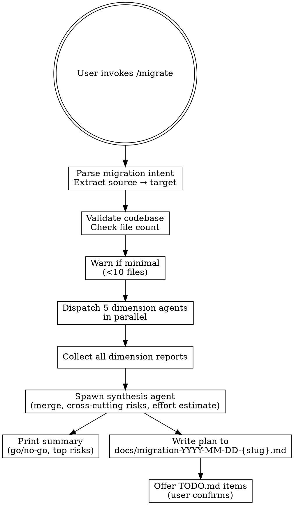

# Migrate

Multi-dimensional migration risk analysis. Spawns five parallel specialist agents, each investigating one dimension of a framework/language/architecture migration, then synthesizes findings into a ranked migration plan with cross-cutting landmine detection.

## Invocation

```
/migrate "Express to Fastify"          # Full analysis
/migrate quick "webpack to vite"        # Quick mode (Sonnet agents)
/migrate                                 # Interactive prompt for migration intent
```

## Input Parsing

Parse invocation into:
1. **Mode**: `quick` or `full` (default)
2. **Migration intent**: Source → target extracted from string (split on "to" / "→" / "->")

Extract source and target from the migration intent string. Warn if codebase has <10 source files: "Minimal codebase detected. Migration analysis may be incomplete."

## Agent Roster

| Agent | Dimension | Model | Investigates |
|-------|-----------|-------|-------------|
| API Surface | Compatibility & transformation | Opus | Import/export analysis, API shape comparison, transformation rules for breaking changes |
| Dependencies | Package ecosystem alignment | Sonnet | package.json/Cargo.toml analysis, replacement package research, version compatibility |
| Tests | Framework & coverage migration | Sonnet | Test files, runner config, coverage gaps, test migration effort |
| Infrastructure | DevOps & deployment | Sonnet | CI/CD config, Docker, deployment pipelines, monitoring changes |
| Data | Schema & persistence | Opus | DB schema, ORM config, data access patterns, migration scripts, rollback strategy |

### Model Strategy

- **Opus**: API Surface and Data use Opus because they require deep reasoning about transformation semantics — mapping old APIs to new ones involves judgment about behavioral equivalence, not just pattern matching. Same for data migrations where rollback and consistency matter.
- **Sonnet**: Dependencies, Tests, Infrastructure — more pattern-matching and inventory work
- **Quick mode override**: See Quick Mode section below

## Execution Flow



## Step-by-Step Protocol

### Step 1: Parse Migration Intent

Extract source and target from invocation:
- `/migrate "Express to Fastify"` → source="Express", target="Fastify"
- `/migrate "webpack→vite"` → source="webpack", target="vite"
- `/migrate` → prompt user: "What migration are you planning? (e.g., 'React to Preact', 'PostgreSQL to MongoDB')"

Error if source = target: "Source and target are the same. No migration needed."

### Step 2: Validate Codebase

Glob for source files: `**/*.{ts,tsx,js,jsx,py,go,rs,java,rb,cs}` etc. Count total files.

If count < 10: Print warning "Minimal codebase detected. Migration analysis may be incomplete. Consider getting a second opinion from a human expert."

Continue regardless.

### Step 3: Dispatch Five Dimension Agents

Spawn all five agents **in parallel** using the Agent tool with the `model` parameter set per the roster table.

**Model assignment** (pass as `model` parameter to Agent tool):
- `model: "opus"` → API Surface, Data
- `model: "sonnet"` → Dependencies, Tests, Infrastructure

**Quick mode override**:
- ALL agents use `model: "sonnet"` regardless of roster defaults
- Add to each agent prompt: "TOKEN BUDGET: Keep exploration under 10 file reads. Prioritize critical findings only. Report top 5 risks per dimension."
- Print before dispatch: "⚡ Quick mode: all agents using Sonnet. Output quality may be lower than full analysis."

Each agent receives this prompt template (fill in `{DIMENSION}`, `{SCOPE}`, `{SOURCE}`, `{TARGET}`):

---

**BEGIN AGENT PROMPT**

You are the {DIMENSION} Migration Analyst. You are assessing the migration from {SOURCE} to {TARGET}.

**Your domain**: {SCOPE}

**Your job**: Identify all risks, compatibility issues, and transformation work required within your dimension. Find what breaks, what maps cleanly, and what requires custom glue code.

**Rules**:
1. Explore the target project's codebase thoroughly. Use Read, Glob, and Grep to understand the current {SOURCE} usage.
2. Use WebSearch or WebFetch to research {TARGET}'s API, migration guides, and known gotchas.
3. For each finding, tag with severity:
   - **CRITICAL**: Blocks migration or causes production failure
   - **HIGH**: Significant work, breaking changes, or compatibility gaps
   - **MEDIUM**: Workarounds exist, but require custom code or refactoring
   - **LOW**: Minor adaptation needed, well-documented path forward
4. For each finding, provide:
   - **What**: Specific incompatibility or breaking change (one sentence)
   - **Impact**: How it affects the project (one sentence)
   - **Transformation**: What needs to change to support {TARGET} (one sentence)
   - **Severity**: One of CRITICAL, HIGH, MEDIUM, LOW
5. At the end, write a **Dimension Summary**: 2-3 sentences on overall migration readiness in this dimension.

**Output format**:

```
## {DIMENSION} Migration Analysis

### Findings

#### [SEVERITY] Short title
- **What**: Description of the incompatibility
- **Impact**: How it breaks or complicates things
- **Transformation**: What code/config changes are needed
- **Severity**: CRITICAL/HIGH/MEDIUM/LOW

### Dimension Summary
[2-3 sentences on readiness]
```

**END AGENT PROMPT**

---

### Step 4: Collect Dimension Reports

Wait for all five dimension agents to return. If any agent times out or fails, note it and continue with partial results.

### Step 5: Dispatch Synthesis Agent

After all dimension agents return, spawn one final **synthesis agent** (`model: "opus"`, always — even in quick mode). Synthesis receives all five dimension reports.

#### Synthesis Agent Prompt

---

**BEGIN SYNTHESIS PROMPT**

You are the Lead Migration Analyst. You have received risk assessments from five dimension specialists. Your job is to synthesize these into a comprehensive migration plan with cross-cutting risk detection.

**Your three jobs:**

#### Job 1: Migration Plan

Create an ordered step-by-step migration plan with dependencies. Each step should:
1. Be reversible (can be partially rolled back)
2. Have clear acceptance criteria
3. Identify which dimension(s) it touches
4. Estimate effort (T-shirt sizing: S/M/L/XL)

Steps should respect dependency order (e.g., dependency migrations before code changes that use new APIs).

#### Job 2: Risk Matrix

Merge all findings from the five dimension reports into a unified risk matrix. Format:

```
| Dimension      | Finding Title                    | Severity | Likelihood | Impact | Risk Level |
|----------------|---------------------------------|----------|-----------|--------|------------|
| API Surface    | Express middleware pattern change| HIGH     | HIGH      | HIGH   | CRITICAL   |
| Dependencies   | No webpack replacement for X      | MEDIUM   | MEDIUM    | HIGH   | HIGH       |
```

Rules for this matrix:
- **Likelihood**: How certain is this to occur during the migration (HIGH/MEDIUM/LOW)?
- **Impact**: If it occurs, how much damage (HIGH/MEDIUM/LOW)?
- **Risk Level**: Combine likelihood × impact → CRITICAL/HIGH/MEDIUM/LOW
- Deduplicate: if multiple dimensions flagged the same risk, merge and note all dimensions affected

#### Job 3: Cross-Cutting Landmine Detection

**EXPLICITLY look for risks that span 2+ dimensions.** These are the most dangerous because no single specialist would flag the full scope.

Examples:
- "Dependency X doesn't support target AND 70% of tests depend on X → this is actually a rewrite, not a migration"
- "Database schema change requires ORM migration (data + infrastructure) AND tests use hardcoded schema assumptions (tests)"
- "Build output paths change in target (infrastructure) AND deployment expects old paths (infrastructure × data)"

For each cross-cutting risk found:
- Name it explicitly
- List all dimensions affected
- Explain why the intersection makes it more dangerous than any single dimension
- Increase its risk level by one tier (e.g., HIGH → CRITICAL)

If you find zero cross-cutting risks, flag this as suspicious: "No cross-cutting risks detected. Either dimensions analyzed independently without coordination (likely), or migration is extremely shallow (unlikely)."

#### Final Output

Produce this exact format:

```markdown
# Migration Plan: {SOURCE} → {TARGET}

## Executive Summary
[1-2 sentences: go/no-go recommendation and conditional caveats]

## Migration Plan

### Phase 1: [Phase Name]
- **Steps**: [list of 2-3 ordered steps]
- **Effort**: [total T-shirt sizing S/M/L/XL and estimated hours range]
- **Rollback**: [how to reverse this phase]
- **Blockers**: [any blocking dependencies from other phases]

(repeat for each phase)

## Risk Matrix

| Dimension      | Finding Title | Severity | Likelihood | Impact | Risk Level |
|----------------|---------------|----------|-----------|--------|------------|
...

## Cross-Cutting Landmines

### [Landmine 1]
- **Dimensions**: API Surface, Tests
- **Risk**: [explanation]
- **Risk Level**: CRITICAL

(repeat for each cross-cutting risk)

## Effort Estimate

- **Per-phase T-shirt sizing**: [S/M/L/XL per phase]
- **Total range**: [X-Y days for full team, or X-Y weeks for individual contributor]
- **Critical path**: [which phases must complete in sequence vs. which can run in parallel]
- **Assumptions**: [what the estimate assumes about team size, expertise, etc.]

## Go/No-Go Recommendation

[Conditional recommendation: "Go, but only if..." or "No, because..." or "Go with caveats:"]

[Reasoning based on risk matrix and cross-cutting landmines]

## Per-Phase Rollback Strategy

### Phase 1
[How to reverse]

### Phase 2
[How to reverse]

(repeat)
```

**Output rules:**
1. Every finding from dimension reports must appear in the risk matrix.
2. Cross-cutting landmines must be explicit — don't bury them in the plan.
3. Effort estimates are ranges, not precise. Show your assumptions.
4. Go/no-go is conditional, rarely a flat "no" unless CRITICAL risks are unmitigatable.
5. Rollback must be per-step, not "go back to old version" — assume partial progress.

**END SYNTHESIS PROMPT**

---

### Step 6: Write Plan to docs/

Write the full synthesis output to `docs/migration-YYYY-MM-DD-{slug}.md` where `{slug}` is the normalized migration name (e.g., `express-to-fastify`).

Migration plans are project-visible — they go in `docs/`, not a dot-dir.

Create `docs/` directory if it doesn't exist.

If a migration plan for the same source→target already exists today, append a counter: `migration-2026-05-08-express-to-fastify-2.md`.

### Step 7: Console Summary

Print migration assessment to console:

```
═══════════════════════════════════════════════
  MIGRATION ANALYSIS — {SOURCE} → {TARGET}
═══════════════════════════════════════════════

  GO/NO-GO: [Recommendation from synthesis]

  TOP RISKS:
    • [CRITICAL] Risk 1
    • [CRITICAL] Risk 2
    • [HIGH] Risk 3

  EFFORT: [Total T-shirt sizing and range]

  CROSS-CUTTING LANDMINES: [Count]

  Full plan: docs/migration-YYYY-MM-DD-{slug}.md
═══════════════════════════════════════════════
```

### Step 8: Persist Backlog

After user confirms, write migration steps to `TODO.md` under a `### Migration {SOURCE} → {TARGET} — YYYY-MM-DD` section.

Items sourced from: Phase steps in the migration plan, ordered by phase dependency.

Format per item:
```
- [PHASE] Step name — effort estimate. See: docs/migration-YYYY-MM-DD-{slug}.md
```

If no `TODO.md` exists: create with `# TODO\n\n## Backlog\n` header.

If `TODO.md` exists but has no `## Backlog` section: append one.

Offer: "Add these steps to TODO.md backlog? (Y/n)"

### Step 9: Offer Design Doc Persistence

After offering backlog items, offer to persist the migration plan as a project design doc:

```
Save as project design doc? This makes findings available to future agents
and implementation sessions.
  → docs/designs/migrate-{slug}-YYYY-MM-DD.md
```

**If accepted**:
1. Read the full migration plan from `docs/migration-YYYY-MM-DD-{slug}.md`
2. Copy the complete plan (executive summary, phases with steps/effort/rollback, risk matrix, cross-cutting landmines, effort estimate, go/no-go recommendation, per-phase rollback strategies) to `docs/designs/migrate-{slug}-YYYY-MM-DD.md`
3. Add frontmatter:
   ```yaml
   ---
   purpose: "Migration plan and risk analysis for {SOURCE} → {TARGET}"
   source-skill: migrate
   date: YYYY-MM-DD
   status: draft
   ---
   ```
4. Strip ephemeral content (console formatting, timestamps)
5. Create `docs/designs/` directory if it doesn't exist
6. On first `docs/designs/` creation in this project, append to project CLAUDE.md:
   ```markdown
   ## Design Docs

   When orienting (switch-in, dian, or starting any session), read all files in `docs/designs/`. These contain decisions, analyses, and strategic plans that inform future work.
   ```
   - Existence check: Grep CLAUDE.md for `## Design Docs` first. If it exists, skip injection.
   - If CLAUDE.md doesn't exist, create it with just this block.
   - If write fails, warn and continue (best-effort).

**If declined**, skip silently.

## Failure Modes & Edge Cases

| Failure | Behavior |
|---------|----------|
| Migration source = target | Error: "Source and target are the same. No migration needed." |
| Codebase has <10 files | Print warning and continue. "Minimal codebase detected. Migration analysis may be incomplete." |
| One or more dimension agents fail/timeout | Include partial results from that agent in synthesis. Synthesis flags dimension as "incomplete analysis." |
| All dimension agents fail | Error: "All migration analysts failed. Check network/tool availability." |
| WebSearch unavailable | Agents use WebFetch as fallback. Note in console summary: "WebSearch unavailable — using WebFetch." |
| Target framework/language not found (WebSearch fails) | Agent reports "Target {TARGET} research inconclusive" and flags HIGH risk. Synthesis escalates uncertainty. |
| One dimension finds zero risk (suspicious) | Synthesis agent flags this: "API Surface dimension found no risks — either extremely shallow migration or analysis incomplete." |
| All dimensions high risk | Recommendation: "No, because — too many unmitigatable CRITICAL risks. Recommend alternative approach or extended timeline." |
| docs/ directory doesn't exist | Create it |
| Migration plan write fails | Print full plan to console only. Warn: "Could not write migration plan to docs/ — plan printed to console only." |
| TODO.md write fails | Print backlog items to console only. Warn: "Could not write to TODO.md — items printed to console only." |

## Edge Cases

- **Monolithic to microservices**: Infrastructure and Data dimensions will be especially complex. Synthesis should flag this upfront.
- **Language change** (Python to Go, JavaScript to Rust): All five dimensions critical. Expect CRITICAL risks in most.
- **Minor version upgrade** (React 18→19): Dependencies and Tests dominate. API Surface and Infrastructure usually LOW.
- **Database change** (PostgreSQL to MongoDB): Data dimension critical. Expect schema redesign and ORM migration.
- **Build tool upgrade** (webpack→vite): Infrastructure and Dependencies dominate. API Surface usually clean.
