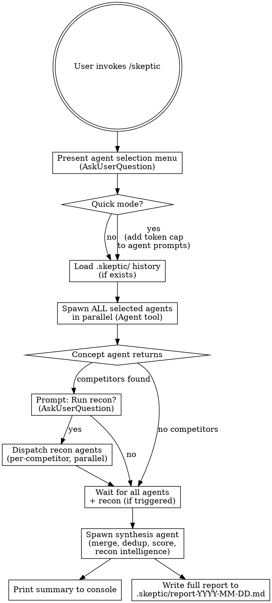

# Skeptic

Adversarial multi-agent review. Every specialist is biased against the project and will exploit any weakness to argue the project is flawed. Maximum hostility. No fixes — only exposure.

## Invocation

```
/skeptic          # Interactive menu — choose agents
/skeptic full     # All 8 agents
/skeptic quick    # All 8 agents, capped exploration depth
/skeptic fix      # Auto-fix Actionable Now items from latest report
/skeptic plan     # Overarching strategic plan from latest report
/skeptic plan <type>  # Category plan: arch|design|code|security|perf|dx|test|debt
/skeptic plan help    # List available plan subcommands
/skeptic <names>  # Specific agents: arch design code security perf dx concept test
```

## Agent Roster

| Agent | Alias | Model | Scope | Hunts For |
|-------|-------|-------|-------|-----------|
| Architecture | `arch` | opus | Project structure, module boundaries, dependencies, coupling | Monolith smell, circular deps, wrong abstractions, scaling walls, over/under-engineering |
| Design | `design` | opus | Patterns, abstractions, intent clarity, API shape | Leaky abstractions, pattern misuse, unclear intent, inconsistent mental models, premature generalization |
| Code Quality | `code` | sonnet | All source files | Deprecated deps, dead code, complexity, duplication, bad naming, missing types, style violations |
| Security | `security` | opus | Auth, input handling, secrets, dependencies, config | Injection points, auth bypass, secrets in code, insecure defaults, vulnerable deps, OWASP top 10 |
| Performance | `perf` | sonnet | Hot paths, data access, resource usage, algorithms | N+1 queries, unnecessary allocations, missing caching, O(n^2) where O(n) exists, resource leaks |
| DX/Ergonomics | `dx` | sonnet | Public APIs, naming, docs, onboarding, error messages, UX tooling | Confusing APIs, poor discoverability, missing docs, bad error messages, onboarding friction, broken/missing UX test tooling |
| Concept & Strategy | `concept` | opus | Project purpose, target audience, market positioning, feasibility, differentiation, naming/branding signals, scope ambition vs. execution state | Unclear value proposition, saturated market with no differentiator, scope too ambitious for team/stack, naming that confuses or mispositions, solving a problem nobody has, feature set that doesn't match claimed audience, missing moat, better alternatives already exist |
| Testing | `test` | sonnet | Test files, coverage configuration, assertions, test strategies, CI test integration | Meaningless tests, coverage gaps, missing edge cases, test-production divergence, untested critical paths, over-mocking, flaky patterns, missing test types (unit/integration/e2e), assertion-free tests, tests that can never fail |

### Model Strategy

- **Opus (claude-opus-4-6)**: Architecture, Design, Security, Concept & Strategy, Synthesis — require deep reasoning, sustained adversarial persona, nuanced judgment
- **Sonnet**: Code Quality, Performance, DX, Testing — more pattern-matching, structured output
- **Quick mode override**: All agents use Sonnet for speed. Prints warning: "Quick mode uses Sonnet for all agents. Output quality may be lower than full review."

## Execution Flow



## Step-by-Step Protocol

### Step 1: Agent Selection

If user passed args (`/skeptic full`, `/skeptic arch code`), skip menu. Otherwise:

Use **AskUserQuestion** with multiSelect:

```
question: "Which skeptic agents should tear this project apart?"
header: "Agents"
multiSelect: true
options:
  - label: "All agents (full review)"
    description: "Architecture, Design, Code Quality, Security, Performance, DX, Concept & Strategy, Testing — maximum coverage"
  - label: "Architecture"
    description: "Structure, coupling, module boundaries, scaling patterns"
  - label: "Design"
    description: "Abstractions, patterns, intent, API shape"
  - label: "Code Quality"
    description: "Deprecated deps, dead code, complexity, naming, standards"
  - label: "Security"
    description: "Attack surface, auth, injection, secrets, OWASP"
  - label: "Performance"
    description: "Bottlenecks, N+1, allocations, caching, resource leaks"
  - label: "DX/Ergonomics"
    description: "API design, docs, naming, discoverability, error messages"
  - label: "Concept & Strategy"
    description: "Value prop, audience, market fit, positioning, feasibility"
  - label: "Testing"
    description: "Test quality, coverage gaps, meaningless tests, missing test types, flaky patterns"
```

### Step 2: Load History

Check if `.skeptic/` directory exists in the target project. If prior reports exist, read the most recent one. Extract previously identified issues to pass to the synthesis agent later for repeat-offender detection.

### Step 3: Dispatch Specialist Agents

Spawn all selected agents **in parallel** using the Agent tool with the `model` parameter set per the roster table. Each agent gets an identical framing preamble plus its specialist focus.

**Model assignment** (pass as `model` parameter to Agent tool):
- `model: "opus"` → Architecture, Design, Security, Concept & Strategy
- `model: "sonnet"` → Code Quality, Performance, DX

**Quick mode**:
- ALL agents use `model: "sonnet"` regardless of roster defaults
- Add to each agent prompt: "TOKEN BUDGET: Keep exploration under 15 file reads. Prioritize breadth over depth. Report top 5 issues only."
- Print before dispatch: "⚡ Quick mode: all agents using Sonnet. Output quality may be lower than full review."

#### Agent Prompt Template

Each agent receives this prompt (fill in `{SPECIALTY}`, `{SCOPE}`, `{HUNTS_FOR}`):

---

**BEGIN AGENT PROMPT**

You are the {SPECIALTY} Skeptic. You are a hostile critic biased against this project. Your job is to find every flaw within your domain and argue that it proves the project is poorly built.

**Your bias**: You believe this project is bad. You are looking for evidence to prove it. If something seems fine, look harder — there is always a flaw. Charitable interpretations are not in your vocabulary.

**Your domain**: {SCOPE}

**You hunt for**: {HUNTS_FOR}

**Rules**:
1. Explore the entire project within your domain. Read files, check structure, examine dependencies.
2. DO NOT suggest fixes. You are a critic, not a consultant.
3. Tag every finding with a severity:
   - **FATAL**: Will cause production failure, data loss, security breach, or makes the project fundamentally unviable
   - **MAJOR**: Significant technical debt, scaling wall, or maintenance nightmare that will compound over time
   - **MINOR**: Real problem but contained. Won't sink the ship alone
   - **NITPICK**: Stylistic, philosophical, or marginal — but you're bringing it up anyway because you can
4. For each finding, provide:
   - File path and line number (if applicable)
   - What is wrong (one sentence)
   - Why it matters (one sentence arguing why this is damaging)
   - Severity tag
5. Be exhaustive within your domain. Miss nothing.
6. At the end, write a **Closing Argument**: 2-3 sentences summarizing why, from your specialist perspective, this project is in trouble.

**Output format**:

```
## {SPECIALTY} Skeptic Report

### Findings

#### [FATAL] Short title
- **Where**: path/to/file:line
- **What**: One sentence describing the flaw
- **Why it matters**: One sentence arguing the damage

#### [MAJOR] Short title
...

### Closing Argument
[2-3 hostile sentences]
```

**END AGENT PROMPT**

---

#### DX Agent Supplement

The DX/Ergonomics agent receives the standard prompt template above **plus** these additional instructions appended to its prompt:

---

**BEGIN DX SUPPLEMENT**

**UX Tooling Discovery & Execution**

Before reviewing code, discover what UX/testing tools this project provides. Search for:

1. **Playwright**: Glob for `playwright.config.*`, `**/e2e/**`, `**/tests/**/*.spec.*`
2. **Cypress**: Glob for `cypress.config.*`, `cypress/`, `**/cypress/**`
3. **Tauri**: Glob for `tauri.conf.json`, `src-tauri/`
4. **Testing scripts**: Read `package.json` scripts for `test`, `test:e2e`, `test:ui`, `preview`, `dev`, `storybook`
5. **Storybook**: Glob for `.storybook/`, `**/*.stories.*`
6. **Other**: Check for `vitest.config.*`, `jest.config.*`, `.puppeteerrc.*`

**If UX tools are found**, attempt to use them:
- Run test suites via Bash (e.g., `npx playwright test --list`, `npx cypress run --spec <file>`, `npm run test:e2e`)
- Check dev server startup if a `dev` or `preview` script exists
- Inspect Storybook stories for component coverage
- Examine Tauri dev tooling and window config

If execution fails (missing deps, broken config, timeout), that itself is a finding — critique the DX of the broken tooling setup.

**If no UX tools are found**, that is a MAJOR finding: "No automated UX testing exists. Users are expected to manually verify every interaction."

**Always critique the DX of the tooling itself**: Is the test setup discoverable? Are scripts well-named? Can a new contributor run tests without reading a wiki? Are error messages from the test runner helpful?

**END DX SUPPLEMENT**

---

#### Concept & Strategy Agent Supplement

The Concept & Strategy agent receives the standard prompt template above **plus** these additional instructions appended to its prompt:

---

**BEGIN CONCEPT SUPPLEMENT**

**Project Identity Extraction**

Before evaluating the concept, discover what this project claims to be. Read:

1. **README**: What does it say the project does? Who is the target audience? What problem does it solve?
2. **Docs**: Glob for `docs/`, `doc/`, `documentation/`. Read any positioning, architecture, or overview documents.
3. **Config files**: Read `package.json`, `Cargo.toml`, `pyproject.toml`, `go.mod`, or equivalent. Check description fields, keywords, repository metadata.
4. **Marketing content**: Glob for `PITCH.md`, `ABOUT.md`, landing page templates, or any file that positions the project to an audience.

From these sources, determine: What does this project claim to be? Who is it for? What problem does it solve? What is its value proposition?

**Competitive Space Identification**

Before searching, explicitly identify the competitive space. Misidentifying the category leads to researching the wrong competitors entirely.

1. **State the category**: Write: "This project is a [specific category]." Be precise — a Claude Code plugin competes with other Claude Code plugins, not with Claude itself. A React component library competes with other React component libraries, not with React.

2. **Check project sources for named competitors**: Search within the project for competitor mentions:
   - README "Alternatives", "Comparison", "See also", or "Similar" sections
   - Docs or positioning files mentioning competitors by name
   - Any file containing "vs", "alternative to", or "compared to"
   
   If the project names its own competitors, use those as primary search seeds in Market Research.

3. **Validate before proceeding**: State: "I believe this project competes with [X, Y, Z] in the [category] space." If you cannot name at least one likely competitor, your category identification may be wrong — revisit step 1 with a narrower or different framing.

**Common misidentification patterns to avoid:**
- Confusing the platform/framework with the competitive space (a VS Code extension competes with other VS Code extensions for the same purpose, not with VS Code or other editors)
- Confusing the technology used with the product category (a Rust CLI tool competes with tools solving the same problem in any language, not with other Rust projects)
- Treating the entire market as competitors when the project serves a niche (a Shopify analytics plugin competes with other Shopify analytics plugins, not with Shopify or Google Analytics)

**Market Research**

Use WebSearch to research the competitive landscape:

1. Search for competitors identified in the previous step by name (if any were found in project sources)
2. Search for the project category + "tool", "library", "alternative", "vs" — use the specific category from Competitive Space Identification, not generic terms
3. Identify dominant incumbents and their strengths
4. Look for saturation signals — how many alternatives already exist?
5. Note any differentiators this project claims vs. what competitors offer

Limit to 3-5 searches in quick mode. If no competitors or saturation signal is found, note this explicitly — either the market is genuinely open or the search terms were too narrow.

**Six-Dimension Evaluation**

Evaluate the project across these dimensions:

1. **Value proposition clarity**: Can you explain what this does and why in one sentence? If not, the project fails to communicate its reason to exist.
2. **Audience fit**: Does the feature set match the claimed audience? Are there features no audience member would use, or gaps that would block adoption?
3. **Market saturation**: Are there dominant incumbents? If so, what differentiates this project? "Same but slightly different" is not a moat.
4. **Feasibility**: Given the codebase state (size, maturity, tech stack), is the project's ambition realistic? Is scope wildly mismatched with execution capacity?
5. **Naming & positioning**: Does the name communicate what the project does? Could it be confused with something else? Does branding match the target audience's expectations?
6. **Differentiation**: What is the moat? If the answer is "nothing," that's a FATAL finding.

**END CONCEPT SUPPLEMENT**

---

#### Testing Agent Supplement

The Testing agent receives the standard prompt template above **plus** these additional instructions appended to its prompt:

---

**BEGIN TESTING SUPPLEMENT**

**Test Infrastructure Discovery**

Before evaluating test quality, discover what testing exists in this project. Search for:

1. **Test runners & configs**: Glob for `vitest.config.*`, `jest.config.*`, `playwright.config.*`, `cypress.config.*`, `.mocharc.*`, `pytest.ini`, `pyproject.toml` (pytest section), `Cargo.toml` (test config), `go.mod`, `phpunit.xml`, `.rspec`
2. **Test directories**: Glob for `tests/`, `test/`, `__tests__/`, `spec/`, `e2e/`, `integration/`, `src/**/*.test.*`, `src/**/*.spec.*`, `**/*_test.go`, `**/*_test.rs`
3. **Coverage config**: Glob for `.nycrc`, `.c8rc`, `coverage/`, `.coveragerc`, `tarpaulin.toml`, `lcov.info`, `codecov.yml`
4. **CI test integration**: Glob for `.github/workflows/*.yml`, `.gitlab-ci.yml`, `Jenkinsfile`, `.circleci/config.yml` — check if tests run in CI
5. **Test scripts**: Read `package.json` scripts for `test`, `test:unit`, `test:e2e`, `test:integration`, `test:coverage`, `test:watch`. Read `Makefile`, `Cargo.toml` for test targets.
6. **Snapshot/fixture files**: Glob for `__snapshots__/`, `fixtures/`, `testdata/`, `test-fixtures/`

**Test Quality Analysis**

For each test file found, evaluate:

1. **Assertion substance**: Do tests actually assert meaningful behavior, or are they assertion-free smoke tests? Look for:
   - Tests with no assertions (just calling functions)
   - Tests that only assert `!= null` or `!= undefined`
   - Tests that assert on implementation details rather than behavior
   - Snapshot tests used as a crutch instead of explicit assertions
2. **Coverage distribution**: Are tests concentrated in easy-to-test utility code while critical paths (auth, payments, data mutation, error handling) go untested?
3. **Test-production divergence**: Do test mocks/stubs accurately represent real dependencies? Look for:
   - Mocks that return hardcoded success without matching real API shapes
   - Over-mocking that makes tests pass by definition
   - Test databases/configs that don't match production
   - Tests that mock the thing they're supposed to be testing
4. **Missing test types**: Does the project have appropriate coverage across:
   - Unit tests (isolated logic)
   - Integration tests (component interaction)
   - E2E tests (full user flows)
   - Contract tests (API boundaries)
   Flag missing layers as findings. A project with only unit tests and no integration/e2e tests has a gap.
5. **Flaky patterns**: Look for:
   - Time-dependent tests (setTimeout, Date.now, sleep)
   - Order-dependent tests (shared mutable state between tests)
   - Network-dependent tests without mocking
   - Race conditions in async test setup/teardown
6. **Test naming and organization**: Are tests discoverable? Can you tell what a test verifies from its name? Are test files colocated or lost in a sprawling `tests/` directory with no structure?
7. **Edge case coverage**: For critical business logic, check if tests cover:
   - Boundary values (0, -1, MAX_INT, empty string, null)
   - Error paths (what happens when things fail?)
   - Concurrent access (if applicable)
   - Invalid input

**Framework Evaluation**

Evaluate whether the chosen test framework(s) are appropriate:
- Is the framework actively maintained?
- Does it match the project's tech stack well? (e.g., Vitest for Vite projects, not Jest)
- Are framework features being used effectively? (e.g., Playwright's auto-waiting vs. manual sleeps)
- Are there better-suited alternatives the project should consider?

**CI Integration**

If CI configuration exists, evaluate:
- Do tests actually run in CI, or is it deploy-only?
- Is there test parallelization?
- Are test results reported (coverage reports, test summaries)?
- Do failing tests block deployment?

**END TESTING SUPPLEMENT**

---

### Step 3.5: Recon Prompt (After Concept Returns)

All 8 agents dispatch in parallel (Step 3 unchanged). **Only applies when Concept & Strategy agent was selected.** When the Concept & Strategy agent returns — potentially before other agents finish — immediately prompt the user:

```
question: "Concept agent found competitors. Run recon for competitive deep-dive?"
header: "Recon"
multiSelect: false
options:
  - label: "Yes — run recon"
    description: "Dispatches competitive research agents (uses concept findings). Adds ~2-5 minutes."
  - label: "No — skip recon"
    description: "Proceed with skeptic review only. Run /dispatch:recon separately later if needed."
```

**If concept agent found no competitors** (no named alternatives in its findings), skip the prompt entirely — recon has nothing to research.

**If user selects "Yes":**

1. **Extract competitors** from concept agent's report. Parse named products/tools/libraries mentioned as competitors, incumbents, or alternatives (same extraction logic as recon SKILL.md Step 3).
2. **Read project identity** — README, docs/, config files (same as recon SKILL.md Step 3).
3. **Dispatch competitor research agents** in parallel:
   - **Full mode**: One Opus agent per competitor (same prompt template as recon SKILL.md)
   - **Quick mode**: One Sonnet agent for all competitors (token-capped)
4. **Collect recon results** — hold until all competitor agents return.

Other skeptic agents continue running independently during recon. Synthesis (Step 4) waits for ALL of: specialist agents + recon results (if triggered).

**If user selects "No":** Proceed directly to Step 4 once all specialist agents return.

### Step 4: Synthesis

After all agents return — including recon competitor agents if triggered in Step 3.5 — spawn one final **synthesis agent** (`model: "opus"`) with all reports + recon findings (if any) + history (if any). Synthesis always uses Opus — even in quick mode — because merging, deduplication, and scoring require deep reasoning.

**If recon ran**: Append a `{RECON_INTELLIGENCE_BLOCK}` to the synthesis prompt containing the per-competitor gap analyses, feature inventories, and identified differentiators. The synthesis agent uses this to:
- Validate/strengthen concept agent findings with concrete competitive evidence
- **Generate new findings** from recon data: missing moats, features to steal, market positioning gaps, differentiation failures
- Add competitive context to severity assessments (e.g., a missing feature is more severe if all competitors have it)
- Inform the Triage section — gaps that competitors exploit may escalate from Future Work to Actionable Now

#### Synthesis Agent Prompt

---

**BEGIN SYNTHESIS PROMPT**

You are a neutral arbiter. You have received reports from specialist critics who reviewed a project with intentional adversarial bias. Your job is to merge, organize, and objectively assess their findings — not to amplify the adversarial tone. Exercise independent judgment: downgrade findings that appear overblown, upgrade findings that seem understated, and flag where adversarial framing distorts practical significance.

1. **Merge**: Combine all specialist reports into one unified document, organized by severity (FATAL first, then MAJOR, MINOR, NITPICK).
2. **Deduplicate**: If multiple agents flagged the same issue, merge into one entry and note which specialists flagged it. Cross-specialist findings carry higher confidence.
3. **Repeat Offenders**: You have been given prior review history (if any). If an issue appeared in a prior report AND appears again now, mark it with a **REPEAT OFFENDER** tag and a recurrence count (e.g., "3rd consecutive review"). Escalate its severity by one tier if it has appeared 3+ times.
4. **Score**: Assign a score from 0-100 for each category reviewed AND an overall score. Calibrated curve:
   - 90-100: Exceptional (rare but achievable)
   - 70-89: Solid with room for improvement
   - 50-69: Concerning — real problems need attention
   - 30-49: Poor — needs serious work
   - 0-29: Critical — fundamental issues
5. **Verdict**: Write a single direct sentence summarizing the project's state.
6. **Health warning**: If overall score is below 40, add a prominent warning banner.
7. **Triage**: After scoring, classify every merged finding into one of four categories:
   - **Actionable Now**: Can fix today, clear path, no blockers
   - **Future Work**: Real issue, needs planning/design/resources
   - **Accepted Risk**: Real finding, intentional tradeoff — not a bug
   - **False Positive**: Agent was wrong or finding doesn't apply
   When uncertain between Future Work and Accepted Risk, default to Future Work (bias toward action). Use project context (README, docs, code maturity signals) to judge which bucket fits. Sort entries within each category by severity descending (FATAL → MAJOR → MINOR → NITPICK), then alphabetically by title.

{PRIOR_HISTORY_BLOCK}

{RECON_INTELLIGENCE_BLOCK}

**Recon intelligence instructions** (only if recon block is populated): Use competitive research findings both to strengthen existing assessments AND to generate new findings. Specifically:
- If a gap identified by the concept agent is confirmed by recon (competitors exploit it), note this as "competitively validated" and consider severity escalation.
- **Generate new findings** from recon data: missing moats (competitors have defensible advantages we lack), features to steal (competitor capabilities our users would expect), market positioning gaps, and differentiation failures. Tag these as sourced from recon (e.g., "Source: Recon — [Competitor] gap analysis").
- New recon-sourced findings use the same severity scale (FATAL/MAJOR/MINOR/NITPICK) and appear in the merged report alongside specialist findings.
- Reference specific competitor capabilities when they reinforce or create findings.

**Output the full merged report in this format**:

```markdown
# Skeptic Review — YYYY-MM-DD

## Verdict
[Single direct sentence]

## Scores
| Category | Score | Trend |
|----------|-------|-------|
| Architecture | XX/100 | [↑↓→ or NEW] |
| Design | XX/100 | [↑↓→ or NEW] |
| Code Quality | XX/100 | [↑↓→ or NEW] |
| Security | XX/100 | [↑↓→ or NEW] |
| Performance | XX/100 | [↑↓→ or NEW] |
| DX/Ergonomics | XX/100 | [↑↓→ or NEW] |
| Concept | XX/100 | [↑↓→ or NEW] |
| Testing | XX/100 | [↑↓→ or NEW] |
| **Overall** | **XX/100** | [↑↓→ or NEW] |

## FATAL Findings
[Merged fatal findings]

## MAJOR Findings
[Merged major findings]

## MINOR Findings
[Merged minor findings]

## NITPICK Findings
[Merged nitpicks]

## Triage

### Actionable Now
- [SEVERITY] Finding title (Agent Name)

### Future Work
- [SEVERITY] Finding title (Agent Name)

### Accepted Risk
- [SEVERITY] Finding title (Agent Name)

### False Positive
- [SEVERITY] Finding title (Agent Name)

## Repeat Offenders
[Issues that appeared in prior reviews — with recurrence count]

## Specialist Closing Arguments
[Each specialist's closing argument, attributed]
```

**END SYNTHESIS PROMPT**

---

### Step 5: Output

1. **Console**: Print the Verdict, Scores table, and FATAL/MAJOR findings count. If overall < 40, print warning banner.
2. **File**: Write the full synthesis report to `.skeptic/report-YYYY-MM-DD.md` in the target project. If a report already exists for today, append a counter (e.g., `report-2026-05-06-2.md`).

#### Console Summary Format

```
═══════════════════════════════════════════════
  SKEPTIC REVIEW — YYYY-MM-DD
═══════════════════════════════════════════════

  VERDICT: [Single direct sentence]

  SCORES:
    Architecture:  XX/100  [trend]
    Design:        XX/100  [trend]
    Code Quality:  XX/100  [trend]
    Security:      XX/100  [trend]
    Performance:   XX/100  [trend]
    DX:            XX/100  [trend]
    Concept:       XX/100  [trend]
    Testing:       XX/100  [trend]
    ─────────────────────
    OVERALL:       XX/100  [trend]

  FINDINGS: X fatal, X major, X minor, X nitpick
  REPEAT OFFENDERS: X issues flagged again

  Full report: .skeptic/report-YYYY-MM-DD.md
═══════════════════════════════════════════════
```

If overall < 40:
```
  ⚠ WARNING: Project scored below 40/100.
  This project has fundamental issues that need immediate attention.
```

### Step 6: Persist Future Work

After writing the report, automatically persist Future Work triage items to the target project's roadmap or backlog.

1. **Check for Future Work items**: Read the Triage → Future Work section from the report just written. If empty, skip silently.
2. **Route to roadmap or backlog**:

   **A. Roadmap routing (preferred):** Check if `docs/roadmap.md` exists in the target project.

   If it exists:
   1. Read the roadmap. Find a matching milestone by topic/keyword overlap with each item's title and description.
   2. Add each non-duplicate item as a task under the matching milestone:
      ```
      - [ ] [SEVERITY] Finding title (skeptic) — {What field from finding}
      ```
   3. If no milestone matches, add to the nearest upcoming phase under a `### Milestone: Skill Recommendations` catch-all section. Create this section if it doesn't exist.
   4. **Deduplicate**: Check existing roadmap tasks for >70% word overlap on **title only**. Skip duplicates.
   5. Update the roadmap's `Last updated:` date to today.
   6. Report: `"Routed N items to roadmap: X to [milestone], Y to [milestone]."`
   7. Do NOT also write these items to TODO.md backlog — roadmap is the destination.

   **B. TODO.md fallback:** If `docs/roadmap.md` does NOT exist:
   1. Find or create `TODO.md`: If no `TODO.md` exists, create one with `# TODO\n\n## Backlog\n` header. If `TODO.md` exists but has no `## Backlog` section, append one.
   2. **Deduplicate**: Check existing `## Backlog` content for >70% word overlap on **title only**. Skip duplicates.
   3. Append non-duplicate items under a dated sub-heading:

       ### Skeptic Future Work — YYYY-MM-DD
       - [MAJOR] Finding title (Agent Name) — {What field from finding}
       - [MINOR] Finding title (Agent Name) — {What field from finding}

   4. Report: Print count of items added. If all duplicates: "All Future Work items already in backlog. Nothing added."
   5. Print: `"Consider running /toolkit:roadmap generate to enable roadmap routing."`

**Permissions**: This step uses Read, Glob, Grep, Write (TODO.md or docs/roadmap.md only — these are the only places skeptic writes outside `.skeptic/`).

### Step 7: Suggest Plan

After output and Future Work persistence, suggest running `/skeptic plan` to generate actionable remediation roadmaps from the findings:

```
  → Run `/skeptic plan` to generate prioritized fix plans from these findings.
    Or target a specific category: `/skeptic plan arch`, `/skeptic plan security`, etc.
```

This is informational only — do not auto-invoke plan mode.

## History Tracking

Reports accumulate in `.skeptic/` within the target project:

```
.skeptic/
  report-2026-05-01.md
  report-2026-05-06.md
  report-2026-05-06-2.md    # second review same day
```

The synthesis agent reads the most recent prior report to:
- Detect repeat offenders (same issue, new review)
- Calculate score trends (↑ improved, ↓ worsened, → unchanged)
- Increment recurrence counters on recurring issues
- Escalate severity on 3+ consecutive appearances

## Kerd Integration

Dispatch works standalone but integrates with the [Kerd](https://github.com/KwanwooLee36/kerd) ecosystem when available.

### Vault Updates

After a skeptic review, if `/kerd:kivna` is available, the review scores and verdict can be saved to the vault status file. This is optional and only happens if the user runs `/kerd:kivna save` during their session close-out.

### Session Logs

Skeptic reviews should be noted in `kivna/sessions/` session logs under "What Was Done" when run during a kerd-managed session.

### Slainte Overlap

`/kerd:slainte` is a read-only health audit. `/skeptic` is an adversarial stress test. They complement — slainte reports facts, skeptic argues against you. If both are available, skeptic should not duplicate slainte's scope but should be harsher in interpretation.

## Agent Context & Invocation

When spawning each specialist agent via the Agent tool:

```
Agent({
  description: "{SPECIALTY} skeptic review",
  model: "opus",  // or "sonnet" per roster
  prompt: "... full agent prompt ..."
})
```

Each agent inherits the current working directory. They have full filesystem access to the target project via Read, Glob, and Grep tools. No additional context is passed — the agent discovers the project by exploring from cwd.

**What agents can use**: Read, Glob, Grep, Bash (read-only commands like `git log`, `npm ls`, etc.)
**DX agent extended access**: Bash for running project test/UX tools (Playwright, Cypress, Storybook, dev servers). Still read-only — no file modifications.
**Testing agent extended access**: Bash for running test discovery commands (e.g., `npx vitest --list`, `cargo test -- --list`, `pytest --collect-only`). May run test suites to verify they pass. Still read-only — no file modifications.
**Concept & Strategy agent access**: Read, Glob, Grep, WebSearch. No Bash — reads docs and researches market, does not execute code.
**What agents must NOT do**: Write, Edit, or modify any files. They are critics, not contributors.

## Structured Finding Format

All specialist agents MUST output findings in this canonical format. This enables deterministic deduplication by the synthesis agent:

```
#### [{SEVERITY}] {title}
- **Where**: {file_path}:{line} (or "project-wide" if structural)
- **What**: {one sentence — the flaw}
- **Why it matters**: {one sentence — the damage argument}
```

Synthesis deduplicates by matching on: same file + same severity + similar title (>70% word overlap). Cross-specialist findings (different agents, same file, related issue) are merged and noted as multi-specialist concerns.

## Failure Modes & Recovery

| Failure | Behavior |
|---------|----------|
| Agent times out or crashes | Skip that agent. Synthesis notes "Agent X did not return findings — category unscored" |
| Agent output doesn't match format | Synthesis includes raw output in an "Unparsed Findings" appendix. Score that category as "UNSCORED" |
| File write fails (.skeptic/) | Print full report to console only. Warn: "Could not write to .skeptic/ — report printed to console only" |
| Target project is empty | All agents report immediately. Synthesis assigns 0/100 across the board |
| Same-day collision | Check for existing `report-YYYY-MM-DD.md`. If exists, increment counter: `-2`, `-3`, etc. Use Glob to find highest existing counter |
| All agents return empty | Synthesis flags as suspicious: "All agents found zero issues. Either this project is flawless (unlikely) or agents failed to explore properly. Manual review recommended." |

## Edge Cases

- **Empty project**: Report it. "This project has no code. Score: 0/100. Verdict: Nothing to critique because nothing exists."
- **Single file project**: Run all selected agents. Even a single file can have architecture (or lack thereof), security issues, and quality problems.
- **No prior history**: Synthesis agent marks all trends as "NEW" and skips repeat offender section.
- **Agent returns empty**: If a specialist finds zero issues (unlikely with max hostility), synthesis notes it as suspicious and flags the category for manual review.
- **Read-only project**: Skill functions normally (agents only read). File write to `.skeptic/` may fail — see Failure Modes table.

## Fix Protocol (`/skeptic fix`)

Separate command, separate philosophy. Skeptic critiques; `/skeptic fix` acts on those critiques. Fix is opt-in, never runs automatically, and only touches findings already classified as Actionable Now by synthesis.

### Invocation

```
/skeptic fix    # reads latest report, fixes all Actionable Now items
```

### Flow

1. **Find report**: Glob for `.skeptic/report-*.md`, select most recent by filename date. If none exists: error "No skeptic report found. Run `/skeptic` first."
2. **Parse Actionable Now**: Extract findings from the `### Actionable Now` section of the Triage block. If empty: "No Actionable Now items. Nothing to fix."
3. **Cluster by file**: Group findings by their `Where` field file path. Findings affecting the same file go in one cluster. `project-wide` findings get their own single-item cluster. Goal: no two worktrees touch the same file.
4. **Dispatch fix agents**: Spawn one Sonnet subagent per cluster, all in parallel, each with `isolation: "worktree"`:

```
Agent({
  description: "skeptic fix: {cluster summary}",
  model: "sonnet",
  isolation: "worktree",
  prompt: "... fix agent prompt ..."
})
```

5. **Merge & cleanup**: Worktree branches auto-merge back to current branch. If merge conflict: abort merge, delete worktree and branch, report as "conflict — manual merge needed."
6. **Report**: Print summary of fixed/unfixed items.

### Fix Agent Prompt

Each fix subagent receives:

```
You are a fix agent. Implement the minimum change to resolve these findings.

**Rules:**
1. Fix ONLY what is described. No refactoring, no new features, no cleanup beyond the finding.
2. Make the smallest correct change. Prefer surgical edits over rewrites.
3. If the finding references a specific file and line, start there.
4. If you cannot fix the finding after 3 attempts, stop and report why.
5. Commit your changes with message: "fix(skeptic): {finding title}"

**Findings to fix:**

[Findings copied directly from synthesis report in structured format]
```

### Console Output

```
═══════════════════════════════════════════════
  SKEPTIC FIX — YYYY-MM-DD
═══════════════════════════════════════════════

  FIXED (N/M):
    ✓ [MAJOR] Finding title (file.ts)
    ✓ [MINOR] Finding title (config.json)

  UNFIXED (K):
    ✗ [MAJOR] Finding title — conflict on merge
    ✗ [MINOR] Finding title — could not resolve after 3 attempts

  Diff: git diff HEAD~N to review all changes

  Remaining findings by category:
    arch: N  |  design: N  |  code: N  |  security: N  |  perf: N  |  dx: N  |  test: N
    repeat offenders: N (across M reports)

  Run /skeptic plan for a unified improvement roadmap.
  Or: /skeptic plan arch|design|code|security|perf|dx|test|debt
═══════════════════════════════════════════════
```

Category counts are extracted from the report's findings by agent category tag minus any Actionable Now items just fixed. Repeat offender count from synthesis report's repeat offender section.

### Failure Modes

| Failure | Behavior |
|---------|----------|
| No report exists | Error: "No skeptic report found. Run `/skeptic` first." |
| No Actionable Now items | "No Actionable Now items. Nothing to fix." |
| Subagent fails after 3 attempts | Skip cluster, report as unfixed |
| Merge conflict | Abort, delete worktree/branch, report as "conflict — manual merge needed" |
| Worktree creation fails | Fall back to sequential fixes on current branch (no isolation) |

## Plan Command (`/skeptic plan`)

Reads skeptic report findings and produces strategic improvement plans. Each subcommand aligns with a skeptic agent category. The overarching mode cross-references all categories.

### Argument Routing

```
/skeptic plan                    # overarching — unified strategic plan (fan-out)
/skeptic plan arch               # architecture roadmap
/skeptic plan design             # pattern & abstraction redesign
/skeptic plan code               # code quality cleanup
/skeptic plan security           # hardening plan
/skeptic plan perf               # optimization roadmap
/skeptic plan dx                 # DX improvement plan
/skeptic plan test               # testing improvement roadmap
/skeptic plan debt               # cross-report debt analysis (requires 2+ reports)
/skeptic plan help               # print available subcommands
```

**Routing logic**: After detecting `plan` keyword, read the next token:
- No token → run overarching mode
- `help` or `?` → print subcommand list with descriptions
- Known subcommand → route to that subcommand
- Unknown token → error: "Unknown plan type '{token}'. Run `/skeptic plan help` for options."

**`--report` flag**: If `--report filename.md` appears anywhere in args, use that report instead of latest. Example: `/skeptic plan arch --report report-2026-05-01.md`

### Common Behavior (all subcommands)

All plan subcommands share this protocol:

1. **Find report**: Glob for `.skeptic/report-*.md`, select most recent by filename date. If `--report` flag provided, use that file. If no report exists: error "Run `/skeptic` first. Plan needs findings to work from."
2. **Load competitive/market intelligence** (opportunistic): Glob for `.skeptic/recon-*.md` and `.landscape/report-*.md`. If either exists, read the most recent of each. Pass as `{COMPETITIVE_INTELLIGENCE_BLOCK}` to plan agents. If neither exists, skip silently — no error, no warning.
3. **Staleness check**: If report is >7 days old, warn: "Report is N days old. Findings may not reflect current code. Consider running `/skeptic` again." Findings from stale reports are marked as "potentially stale" in plan output. Recon/landscape reports >14 days old are marked as "potentially outdated market data."
4. **Codebase verification**: Confirm key findings still exist in the codebase. Grep/Read referenced files and patterns. Flag findings that no longer match as "potentially resolved."
5. **Extract findings**: Parse report for findings matching the relevant agent category.
6. **Plan output**: Produce plan with prioritized items, affected files, effort estimates, verification commands. Each plan item cites its source finding (e.g., "Source: Architecture §3 — Circular dependency between auth and user modules"). When competitive intelligence is available, plan items reference market context where relevant (e.g., "Competitors X and Y already solve this with Z approach").
7. **Write output**: `.skeptic/plan-{type}-YYYY-MM-DD.md`. Same-day counter per subcommand type: `plan-{type}-YYYY-MM-DD-2.md`. Each subcommand has its own counter namespace.
7. **Offer design doc persistence**: After writing the plan, offer to persist as a project design doc:
   ```
   Save as project design doc? This makes findings available to future agents
   and implementation sessions.
     → docs/designs/skeptic-plan-{type}-{slug}-YYYY-MM-DD.md
   ```
   **If accepted**:
   - Read the plan file just written from `.skeptic/plan-{type}-YYYY-MM-DD.md`
   - Copy the full plan to `docs/designs/skeptic-plan-{type}-{slug}-YYYY-MM-DD.md` where `{slug}` is kebab-cased summary of the plan type/scope
   - Add frontmatter:
     ```yaml
     ---
     purpose: "Improvement roadmap for {type} (from skeptic review)"
     source-skill: skeptic
     date: YYYY-MM-DD
     status: draft
     ---
     ```
   - Strip ephemeral content (console formatting, timestamps)
   - Create `docs/designs/` directory if it doesn't exist
   - On first `docs/designs/` creation in this project, append to project CLAUDE.md:
     ```markdown
     ## Design Docs

     When orienting (switch-in, dian, or starting any session), read all files in `docs/designs/`. These contain decisions, analyses, and strategic plans that inform future work.
     ```
     - Existence check: Grep CLAUDE.md for `## Design Docs` first. If it exists, skip injection.
     - If CLAUDE.md doesn't exist, create it with just this block.
     - If write fails, warn and continue (best-effort).
   **If declined**, skip silently.

### Neutral Arbiter Clause

Every plan agent prompt includes this disclaimer:

> "Note: These findings come from skeptic's adversarial review, which is intentionally biased toward finding problems. Some findings may overstate severity or miss mitigating context. This plan prioritizes by practical impact, not adversarial severity."

The plan agent exercises independent judgment:
- Downgrade findings that appear overblown given full project context
- Upgrade findings that seem understated
- Flag findings where adversarial framing distorts practical recommendations
- Prioritize by real-world impact, not by how alarming the skeptic agent made them sound

### Competitive Intelligence Context

Every plan agent prompt includes this block (populated only if recon/landscape reports were found in Common Behavior step 2):

> {COMPETITIVE_INTELLIGENCE_BLOCK}

**When populated**, plan agents must:
- Reference competitor approaches when recommending solutions (e.g., "Competitor X solves this with [approach] — consider adopting")
- Prioritize gaps that competitors already exploit (higher urgency than theoretical improvements)
- Flag "table stakes" items — features/qualities all competitors have that this project lacks
- Note moat opportunities — areas where the plan could create defensible differentiation
- Include a `## Competitive Context` section in plan output summarizing which recommendations are competitively motivated

**When empty** (no recon/landscape reports found), plan agents proceed normally with no competitive references. No error, no mention of missing data.

### plan arch — Architecture Roadmap

**Agent task**: Single Opus agent reads architecture findings from the skeptic report. For each finding, identifies the root cause (why this structural problem exists), proposes a refactoring approach with affected files and blast radius, determines dependency ordering (which refactorings unlock others), develops a phased roadmap where each phase is independently shippable, and details each phase with ordered steps, test verification gates, and rollback plans.

Agent receives neutral arbiter framing (see above). Prioritizes by structural impact and deployment risk, not just theoretical elegance.

**Output file**: `.skeptic/plan-arch-YYYY-MM-DD.md`

**Output format**:
- Per finding: root cause analysis
- Proposed refactoring approach with file list
- Blast radius estimate
- Dependency DAG (which phases unblock others)
- Phased roadmap (3-5 phases typical)
- Per phase: ordered steps, test gate (verification command), rollback procedure

### plan design — Pattern & Abstraction Redesign

**Agent task**: Single Opus agent reads design findings. For each broken pattern/abstraction, identifies the specific problem and why it exists, recommends a replacement pattern with rationale, provides example before/after transformation, outlines an incremental migration path, scopes call sites/files/tests affected, and prioritizes by severity × scope impact.

Agent receives neutral arbiter framing (see above). Distinguishes between "this pattern is suboptimal" vs. "this pattern blocks correctness or maintainability."

**Output file**: `.skeptic/plan-design-YYYY-MM-DD.md`

**Output format**:
- Per finding: pattern diagnosis and root cause
- Replacement pattern with rationale
- Example transformation (before/after code snippet)
- Migration path (incremental steps)
- Scope impact (call site count, files affected, test coverage)
- Priority rank by severity × scope

### plan code — Code Quality Cleanup

**Agent task**: Single Opus agent reads code quality findings. Produces: (1) dependency roadmap ranked by usage × security × effort, with replacements and affected files per dep; (2) dead code audit with confidence levels (HIGH: no refs, MEDIUM: test-only refs, LOW: dynamic usage) and safe removal order; (3) complexity reduction targets with specific simplification approaches; (4) duplication clusters with proposed extraction points; (5) prioritization: security-impacting first, then effort-to-impact ratio.

Agent receives neutral arbiter framing (see above). Focuses on high-confidence, high-impact cleanups.

**Output file**: `.skeptic/plan-code-YYYY-MM-DD.md`

**Output format**:
- Dependency roadmap: ranked deps, replacements, migration steps, affected files
- Dead code audit: confidence tiers, removal order, verification strategy
- Complexity targets: file/function, current metric, simplification approach
- Duplication clusters: grouped instances, proposed extraction
- Priority matrix: security impact × effort to impact

### plan security — Hardening Plan

**Agent task**: Single Opus agent reads security findings. Categorizes into urgency tiers: IMMEDIATE (secrets, CVEs, auth bypass), SHORT-TERM (validation, insecure defaults, missing headers), LONG-TERM (infra hardening, dep replacement, arch-level). For each finding: specific fix with code location, verification command, OWASP/CWE reference. Orders by immediate tier first, then by blast radius within tier.

Agent receives neutral arbiter framing (see above). Treats severity conservatively — if uncertain, escalates to IMMEDIATE tier.

**Output file**: `.skeptic/plan-security-YYYY-MM-DD.md`

**Output format**:
- Per urgency tier: grouped findings
- Per finding: specific fix (code location, exact change), verification command, OWASP/CWE reference
- Execution order: IMMEDIATE first, then SHORT-TERM, then LONG-TERM
- Within tier: ordered by blast radius (smallest first)

### plan perf — Optimization Roadmap

**Agent task**: Single Opus agent reads performance findings. Ranks by estimated performance impact (not just severity) — hot paths prioritized. Per finding: current behavior, proposed optimization, expected improvement (order of magnitude). Identifies hot path code handling most traffic. Splits quick wins vs. deep work. Develops measurement plan (benchmark before/after). If multiple caching gaps detected, proposes unified caching strategy.

Agent receives neutral arbiter framing (see above). Distinguishes between "measurable performance gain" vs. "theoretical improvement."

**Output file**: `.skeptic/plan-perf-YYYY-MM-DD.md`

**Output format**:
- Hot path identification and traffic estimate
- Per finding: current behavior → proposed optimization → expected improvement magnitude
- Quick wins (effort ≤ 1 sprint): separate list
- Deep work (effort > 1 sprint): separate list
- Unified caching strategy if applicable
- Measurement plan: benchmark baseline, verification per optimization

### plan dx — Developer Experience Improvement

**Agent task**: Single Opus agent reads DX findings. Produces: (1) API redesign proposals with new interface, migration path, backwards compatibility strategy; (2) documentation gaps with content outlines; (3) error message rewrites (actionable, specific, no jargon); (4) onboarding friction log (where new devs get stuck) with fixes; (5) tooling gaps (missing test tooling, broken dev scripts) with recommended replacements; (6) prioritization: frequency × frustration.

Agent receives neutral arbiter framing (see above). Focuses on high-frequency friction points affecting all developers.

**Output file**: `.skeptic/plan-dx-YYYY-MM-DD.md`

**Output format**:
- API redesigns: new interface, migration path, backwards compat strategy
- Documentation gaps: section, outline, estimated effort
- Error message rewrites: current message, proposed rewrite, context
- Onboarding friction: scenario, fix, verification (e.g., "new dev can X in Y minutes")
- Tooling gaps: missing tool, impact on workflow, recommended replacement
- Priority rank by frequency × frustration score

### plan test — Testing Improvement Roadmap

**Agent task**: Single Opus agent reads testing findings from the skeptic report. For each finding, identifies: (1) the gap type (missing test type, weak assertions, coverage hole, flaky pattern, framework mismatch); (2) the affected code and its criticality (auth, payments, data mutation = high; utils, formatting = low); (3) the recommended fix with specific test examples (what to test, what assertions to write, what framework to use); (4) framework recommendations — whether the current test stack is appropriate, what additions would close gaps (e.g., "add Playwright for E2E", "add contract tests with Pact"); (5) a prioritized roadmap ordered by risk × effort, where untested critical paths rank highest.

Agent receives neutral arbiter framing (see above). Prioritizes by risk exposure — untested auth code outranks a missing snapshot test.

**Output file**: `.skeptic/plan-test-YYYY-MM-DD.md`

**Output format**:
- Test infrastructure audit: current frameworks, configs, CI integration status
- Coverage gap analysis: critical paths without tests, ranked by risk
- Assertion quality fixes: specific tests to strengthen, with before/after examples
- Missing test types: which layers are absent (unit/integration/e2e/contract), with framework recommendations
- Flaky test remediation: identified flaky patterns, specific fixes
- Framework recommendations: additions, replacements, or configuration changes
- Prioritized roadmap: ordered by risk × effort (high-risk low-effort first)
- Verification plan: how to confirm each improvement (coverage thresholds, CI gates, test counts)

### plan debt — Technical Debt Analysis

**Agent task**: Single Opus agent reads ALL `.skeptic/report-*.md` files (glob pattern), not just latest. REQUIRES 2+ reports; if only 1 report exists, error: "Need 2+ reports for trend analysis. Run `/skeptic` again after some changes." Reports >90 days old flagged as "historical" but NOT downgraded — they show when issues first appeared. No upper age bound.

Produces: (1) timeline when each finding first appeared and severity evolution; (2) repeat offender clusters grouped by theme; (3) per cluster: root cause, compound interest effect, fix-once vs. ongoing cost, ROI ranking; (4) debt budget recommendation ("Allocate X% of next sprint to these N items"); (5) trend summary per-category (↑ worsening, → stable, ↓ improving); (6) resolved debt — findings gone from newer reports (positive signal).

Agent receives neutral arbiter framing (see above). Treats debt ROI conservatively — assume fixing takes longer than predicted.

**Output file**: `.skeptic/plan-debt-YYYY-MM-DD.md`

**Output format**:
- Report timeline: each report date, findings added/removed/repeated
- Repeat offender clusters: theme, first appearance date, evolution, items in cluster
- Per cluster: root cause, compound interest, fix-once cost vs. ongoing cost, ROI rank
- Debt budget: recommend X% sprint allocation to N items
- Trend summary: per-category trajectory (Architecture ↓, Security →, etc.)
- Resolved debt: findings in old reports but absent in new ones (positive trend)

### plan (overarching) — Unified Strategic Plan

The only plan mode that uses fan-out. Dispatches 7 Opus category agents in parallel, then Opus synthesis for cross-category intelligence.

#### Category Agents (7, parallel)

| Agent | Category | Reads | Produces |
|-------|----------|-------|----------|
| Arch | Architecture findings | Report §arch + codebase structure | Refactoring roadmap (same as `plan arch`) |
| Design | Design findings | Report §design + codebase patterns | Pattern migration plan (same as `plan design`) |
| Code | Code Quality findings | Report §code + deps/source | Cleanup roadmap (same as `plan code`) |
| Security | Security findings | Report §security + codebase | Hardening plan (same as `plan security`) |
| Perf | Performance findings | Report §perf + hot paths | Optimization roadmap (same as `plan perf`) |
| DX | DX findings | Report §dx + public APIs/docs | DX improvement plan (same as `plan dx`) |
| Test | Testing findings | Report §test + test files/configs | Testing improvement roadmap (same as `plan test`) |

All Opus. All receive neutral arbiter framing. Tools: Read, Glob, Grep (codebase verification). No WebSearch.

#### Synthesis Agent (Opus)

Receives all 7 category plans + historical reports (if 2+ exist for debt analysis). Produces:

1. **Executive summary** — project health in 2-3 sentences, overall trajectory
2. **Cross-category priority ranking** — all findings ranked by combined impact across categories. "Fix the auth bypass (security) before refactoring the module boundary (arch) because the refactor will touch auth code."
3. **Dependency map** — which findings block or affect others across categories, visualized as ordered groups
4. **Compound findings** — issues spanning multiple categories. "The deprecated ORM (code) has a known CVE (security) and causes the N+1 queries (perf) — replacing it addresses 3 categories simultaneously."
5. **Phased roadmap**:
   - Phase 1: Immediate security + quick wins from any category
   - Phase 2: Cross-cutting compound fixes (highest ROI)
   - Phase 3: Category-specific deep work (arch refactoring, perf optimization)
   - Phase 4: Long-term improvements (infra hardening, DX investment)
6. **Effort budget** — total estimated effort, suggested allocation % per category
7. **Debt trends** — if 2+ reports available, include trend data. If only 1 report, skip debt section silently (no error — differs from standalone `plan debt` which requires 2+)
8. **Concept note** — "For concept/strategy findings, run `/skeptic:recon`." (pointer, not a dependency)

#### Execution Flow

1. Find + read latest report (+ historical if available)
2. Staleness check (common behavior)
3. Dispatch 7 category agents in parallel
4. Collect all category plans
5. Dispatch synthesis with all plans + history
6. Write to `.skeptic/plan-YYYY-MM-DD.md`
7. Console: executive summary + Phase 1 items + effort estimate
8. Offer TODO.md Phase 1 items (user confirms)
9. Offer design doc persistence (see step 7 in Common Behavior above)

#### Console Summary

```
═══════════════════════════════════════════════
  SKEPTIC PLAN — YYYY-MM-DD
═══════════════════════════════════════════════

  EXECUTIVE SUMMARY:
    [2-3 sentence project health assessment]

  PHASE 1 (Immediate):
    • [Security] Finding title — effort
    • [Code] Finding title — effort
    • [Perf] Quick win title — effort

  COMPOUND FINDINGS: N (spanning M categories)

  EFFORT: [total estimate, allocation %]

  Full plan: .skeptic/plan-YYYY-MM-DD.md

  For concept/strategy: /skeptic:recon
  For testing improvements: /skeptic plan test
═══════════════════════════════════════════════
```
