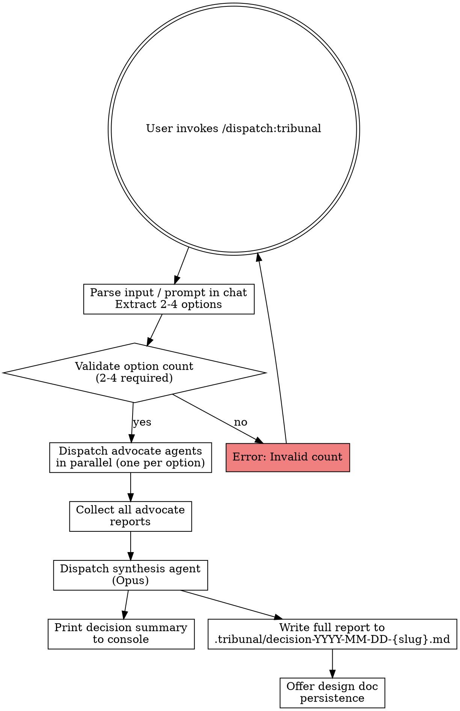

# Tribunal

Structured multi-perspective decision analysis. Spawns competing advocate agents — each assigned ONE option and arguing FOR it with evidence and reasoning. Synthesis agent merges all perspectives, identifies table stakes and divergence points, and recommends the strongest path forward.

## Invocation

```
/dispatch:tribunal "Postgres vs DynamoDB"
/dispatch:tribunal "monolith vs microservices vs modular monolith"
/dispatch:tribunal                              # Prompts interactively for decision and options
```

## Input Parsing

If user provides quoted string (`/dispatch:tribunal "option1 vs option2 vs option3"`):
- Split on `vs` / `or` / commas (case-insensitive split boundaries, trim whitespace)
- Extract options and validate count (2-4 required)
- Error if outside range: "Tribunal requires 2-4 options. You provided X."

If user provides no args (`/dispatch:tribunal`):
- Prompt in plain conversation for the decision title and 2-4 options, then wait for the reply (see Step 1 for the exact prompt). Not `AskUserQuestion` — that tool offers fixed choices, and these inputs are free text.
- Parse the reply with the same split rule as the quoted form, then proceed

**Project context is mandatory** — all advocate agents read the codebase, understand current architecture, constraints, and tech stack. Decisions are grounded in the specific project, never abstract.

## Advocate Agent Prompt Template

Each advocate agent is assigned ONE option and argues FOR it. Include project context reading instructions and evidence gathering. Follow the `**BEGIN PROMPT**` / `**END PROMPT**` pattern.

Each agent receives:

```
Model: opus
Tools: Read, Glob, Grep, WebSearch
```

---

**BEGIN ADVOCATE PROMPT**

You are an advocate for **{OPTION}**. Your job is to argue FOR this option with strength and clarity. You are not neutral — you believe this is the right path. Back up your argument with evidence: project constraints, codebase facts, benchmarks, case studies, and reasoning.

**The decision**: {DECISION_TITLE}

**Your assigned option**: {OPTION}

**Competing options**: {OTHER_OPTIONS_COMMA_SEPARATED}

**Rules**:

1. **Read the project** (Read, Glob, Grep): Understand current architecture, tech stack, team size, maturity, constraints, and goals. All arguments must be grounded in what the project actually is.

2. **Gather evidence** (WebSearch): Find benchmarks, performance data, case studies, user feedback, or technical comparisons that support your position. For established technologies, prefer official documentation and peer-reviewed sources.

3. **Argue FOR your option**, not against others. Frame your case positively: "Here's why {OPTION} excels at X," not "Here's why others fail at X."

4. **Address counterarguments preemptively** (one paragraph): Acknowledge the strongest argument against your option, then explain why it's outweighed by your option's benefits or why the concern doesn't apply to this project.

5. **Ground all claims in project reality**: Constraints matter. If the project is small, argue why simplicity matters. If it's at scale, argue why it's ready for complexity. If budget/time is tight, argue alignment with constraints.

6. **Output format**:

```
## Advocate Report: {OPTION}

### Case Summary
[2-3 sentences: what this option is, why it's right for this decision]

### Evidence
[Bulleted facts and sources — benchmarks, case studies, feature comparison, project fit]

### Counterargument Preemption
[1 paragraph: acknowledge the strongest critique, explain why it doesn't overcome your position]

### Closing Argument
[2-3 sentences: final persuasive summary of why this option should be chosen]
```

**END ADVOCATE PROMPT**

---

## Synthesis Agent Prompt

After all advocate agents return, spawn one final **synthesis agent** (`model: "opus"`) that receives all advocate reports and the original decision context. Synthesis identifies overlaps, conflicts, and produces a recommendation.

---

**BEGIN SYNTHESIS PROMPT**

You are the Lead Decision Analyst. You have received advocate reports arguing for each competing option in a technical decision. Your job is to synthesize these perspectives and produce a structured decision framework.

**The decision**: {DECISION_TITLE}

**Competing options**: {ALL_OPTIONS}

**You have four jobs:**

#### Job 1: Comparison Matrix

Create a markdown table comparing all options across these dimensions:

- **Simplicity** (1-5 scale, 5 = easiest to understand/implement)
- **Performance** (1-5 scale, 5 = best for this project's use case)
- **Cost/Resources** (1-5 scale, 5 = cheapest/lowest resource overhead)
- **Team Fit** (1-5 scale, 5 = best match for team skills/experience)
- **Scalability** (1-5 scale, 5 = handles expected growth best)
- **Maintenance Burden** (1-5 scale, 5 = lowest long-term friction)

Fill each cell with the advocate's claim and a 1-5 score based on their evidence. Be honest — if all advocates claim high scores, don't just repeat them. Synthesize from evidence presented.

#### Job 2: Agreement & Divergence

**Table Stakes (points all advocates agree on):**
- Identify claims made by 2+ advocates with no disagreement. These are given facts about the options or the project that frame the decision space.

**Divergence Points (where advocates contradict):**
- Identify claims where advocates make conflicting assertions (e.g., "Postgres is overkill" vs. "Postgres is necessary for scale"). Explain the disagreement — it often reflects different assumptions about project constraints or future growth.

#### Job 3: Risk Pre-Mortem

For each option, write a 2-3 sentence pre-mortem: "It is [future date, 6-12 months from now]. We chose {OPTION} and it failed. What went wrong?"

Identify real risks: scalability wall, operational complexity, team churn, misfit with stated goals, lock-in, or regret scenarios. Ground in the advocate reports.

#### Job 4: Recommendation

**Recommendation with confidence level:**
- **HIGH**: One option is clearly better. Advocates for other options had weaker evidence or made unconvincing counterarguments.
- **MEDIUM**: The best option is marginally better. Multiple options are viable, but one has an edge.
- **LOW**: Options are roughly equal. No clear winner.

**Tie-breaking logic** (used when confidence is LOW):
- Prefer simpler option (fewer dependencies, smaller blast radius, easier to understand)
- Prefer option with less lock-in (easier to switch away if needed later)
- If still tied: state "Decision is ambiguous. Recommend team discussion to align on priorities (simplicity vs. capability vs. risk)."

**Output format**:

```
## Comparison Matrix

[Table as described above]

## Table Stakes
[Bulleted list of agreed-upon facts]

## Divergence Points
[Bulleted list with explanation of disagreements]

## Risk Pre-Mortem

### {OPTION 1}
[2-3 sentences: failure scenario]

### {OPTION 2}
[2-3 sentences: failure scenario]

(repeat per option)

## Recommendation

**Chosen: {OPTION}**

**Confidence: HIGH / MEDIUM / LOW**

**Reasoning:** [2-3 sentences explaining why this option best serves the project given evidence, constraints, and risks]

## Dissent Note

**Strongest argument against this recommendation:**
[1 paragraph: what advocates for other options got right, and why that concern is real but outweighed by the chosen option's advantages]
```

**END SYNTHESIS PROMPT**

---

## Execution Flow



## Step-by-Step Protocol

### Step 1: Parse Input / Prompt for Decision

If user provided `/dispatch:tribunal "option1 vs option2 vs option3"`:
- Split on `vs`, `or`, and commas (case-insensitive split boundaries) — same rule as Input Parsing
- Trim whitespace from each option
- Extract list of options

If user provided `/dispatch:tribunal` with no args:
- **Ask in plain conversation and wait for the reply** — the options are free text, and `AskUserQuestion` presents fixed multiple-choice options only. Do not use it here.
- Print exactly:
  ```
  What decision are you making, and what are the options?

  Give a short decision title, then 2-4 options — one per line, or on one line
  separated by "vs" / "or" / commas.

  Example:
    Database choice
    Postgres vs DynamoDB vs SQLite
  ```
- Parse the reply with the same split rule as the argument form. If the reply yields fewer than 2 options, ask once more with the same prompt; if it still yields fewer than 2, exit cleanly with the Step 2 error.

### Step 2: Validate Option Count

Check: `2 <= len(options) <= 4`

- If < 2: Error "Tribunal requires 2-4 options. You provided X."
- If > 4: Error "Tribunal requires 2-4 options. You provided X."

Proceed only if valid.

### Step 3: Dispatch Advocate Agents

Spawn one Agent per option in parallel:

```
Agent({
  description: "tribunal advocate: {OPTION}",
  model: "opus",
  prompt: "... filled advocate prompt ..."
})
```

All agents inherit cwd (the target project). They explore via Read, Glob, Grep to understand the project context.

Print to console: "Dispatching {N} advocates (one per option)..."

### Step 4: Collect Advocate Reports

Wait for all advocates to return. If any agent times out or fails, note in synthesis: "Advocate for {OPTION} did not return findings — that perspective is incomplete."

### Step 5: Dispatch Synthesis Agent

Spawn synthesis agent (opus) with:
- All advocate reports (concatenated)
- Original decision title
- Original option list

```
Agent({
  description: "tribunal: synthesize decision",
  model: "opus",
  prompt: "... filled synthesis prompt ..."
})
```

### Step 6: Console Summary

Print decision summary in format:

```
═══════════════════════════════════════════════
  TRIBUNAL DECISION — YYYY-MM-DD
═══════════════════════════════════════════════

  DECISION: {DECISION_TITLE}

  RECOMMENDATION: {CHOSEN_OPTION}
  CONFIDENCE: {HIGH | MEDIUM | LOW}

  OPTIONS EVALUATED: {N}
    ✓ {OPTION 1}
    ✓ {OPTION 2}
    (etc.)

  KEY FACTORS:
    - [Table stakes agreement 1]
    - [Divergence point 1]
    - [Risk consideration 1]

  Full decision: .tribunal/decision-YYYY-MM-DD-{slug}.md
  Design doc: offered next (Step 8)
═══════════════════════════════════════════════
```

This block is the **canonical** console summary — the Console Output Format section below documents the same block plus the low-confidence addendum, not a second variant.

### Step 7: Write Full Report

Write synthesis output (full comparison matrix, divergence points, pre-mortems, recommendation, dissent note) to:

```
.tribunal/decision-YYYY-MM-DD-{slug}.md
```

Where `{slug}` is kebab-case of the decision title (e.g., `decision-2026-05-08-postgres-vs-dynamodb.md`).

Create `.tribunal/` directory if it doesn't exist.

If a report already exists for today with the same slug, append counter: `-2`, `-3`, etc.

### Step 8: Offer Design Doc Persistence

After writing the full report to `.tribunal/`, offer to persist the decision as a project design doc:

```
Save as project design doc? This makes findings available to future agents
and implementation sessions.
  → docs/designs/tribunal-{slug}-YYYY-MM-DD.md
```

**If accepted**:
1. Read the synthesis output from `.tribunal/decision-YYYY-MM-DD-{slug}.md`
2. Copy the full synthesis report (comparison matrix, table stakes, divergence points, pre-mortems, recommendation, dissent note) to `docs/designs/tribunal-{slug}-YYYY-MM-DD.md`
3. Add frontmatter:
   ```yaml
   ---
   purpose: "Architectural decision record for {DECISION_TITLE}"
   source-skill: tribunal
   date: YYYY-MM-DD
   status: draft
   ---
   ```
4. Strip ephemeral console formatting (box drawing, progress indicators, dates in headers)
5. Create `docs/designs/` directory if it doesn't exist
6. On first `docs/designs/` creation in this project, append to project CLAUDE.md:
   ```markdown
   ## Design Docs

   When orienting (switch-in, dian, or starting any session), read `docs/designs/INDEX.md` (one line per doc: title, status, hook) and open individual docs on demand — skip `superseded` entries, and archive shipped docs to `docs/archive/`. If no `INDEX.md` exists, read the files directly, and create one once the directory exceeds a few docs. These contain decisions, analyses, and strategic plans that inform future work.
   ```
   - Existence check: Grep CLAUDE.md for `## Design Docs` first. If it exists, skip injection.
   - If CLAUDE.md doesn't exist, create it with just this block.
   - If write fails, warn and continue (best-effort).

**If declined**, skip silently.

## Failure Modes & Edge Cases

| Failure | Behavior |
|---------|----------|
| User provides < 2 options | Error: "Tribunal requires 2-4 options. You provided X." Re-prompt. |
| User provides > 4 options | Error: "Tribunal requires 2-4 options. You provided X." Prompt to narrow. |
| Agent times out or crashes | Synthesis notes: "Advocate for {OPTION} did not return — that perspective is incomplete." Proceed with partial advocates. |
| Agent output doesn't match format | Synthesis includes raw output in an "Unparsed Advocate Report" appendix. Synthesis extracts key claims if possible. |
| Empty project (no codebase) | All advocates report with minimal context. Synthesis notes: "Project has limited codebase — decision analysis based on general principles rather than project-specific constraints." |
| All advocates agree (unanimous) | Synthesis notes this explicitly: "Unanimous agreement on {CHOSEN_OPTION}. Debate is low-value — all advocates converge on the same option." Mark confidence as HIGH. |
| .tribunal/ directory doesn't exist | Create it automatically. |
| File write fails | Print full report to console only. Warn: "Could not write to .tribunal/ — report printed to console only." |
| Two identical options provided | Warn: "Options '{A}' and '{B}' are identical or nearly identical. Deduplicating to single option." Reduce option count and proceed. |

## Edge Cases

- **Unanimous decision**: All advocates argue for the same option (rare). Synthesis notes this and recommends proceeding with high confidence. No dissent note needed.
- **2 options (minimal)**: Tribunal runs normally. Comparison and divergence still valuable. Synthesis notes: "Minimal option set — consider whether 3rd option should be evaluated."
- **4 options (maximum)**: Tribunal runs normally. Comparison matrix has 4 rows. Advocacy becomes more nuanced as each agent needs to differentiate from 3 others.
- **Project has no README**: Advocates work with minimal documentation. Synthesis notes in report: "Limited project documentation found — decision analysis based on codebase inspection."
- **Decision is purely technical with no real tradeoffs**: All advocates may present weak counterarguments because the decision is clear-cut. Synthesis flags this: "Decision space has limited tradeoffs — one option dominates across multiple dimensions."

## History & Persistence

Reports accumulate in `.tribunal/` within the target project:

```
.tribunal/
  decision-2026-05-08-postgres-vs-dynamodb.md
  decision-2026-05-15-monolith-vs-microservices.md
```

No trend tracking or repeat detection (unlike skeptic). Each decision is a one-time artifact. Decisions can be exported to vault (via `/kerd:kivna save`) for long-term reference and architecture document persistence.

## Kerd Integration

Dispatch works standalone but integrates with the [Kerd](https://github.com/KwanwooLee36/kerd) ecosystem when available.

### Vault Updates

After a tribunal decision, if `/kerd:kivna` is available, the decision report can be persisted to vault as an architectural decision record (ADR). This is optional and only happens if the user runs `/kerd:kivna save` during their session close-out.

### Session Logs

Tribunal decisions should be noted in `kivna/sessions/` session logs under "What Was Done" when run during a kerd-managed session.

## Agent Context & Invocation

When spawning each advocate agent via the Agent tool:

```
Agent({
  description: "tribunal advocate: {OPTION}",
  model: "opus",
  prompt: "... full advocate prompt ..."
})
```

Each agent inherits the current working directory. They have full filesystem access to the target project via Read, Glob, and Grep tools.

**What agents can use**: Read, Glob, Grep, WebSearch

**What agents must NOT do**: Write, Edit, or modify any files. They are advocates, not implementers.

## Console Output Format

Console summary printed after synthesis completes: **use the block in Step 6 verbatim** — it is the single canonical format. `KEY FACTORS` is filled with actual findings (one table-stakes agreement, one divergence point, one risk consideration), not with the category labels themselves.

Design-doc persistence is **not** a manual step and is not deferred to another tool: Step 8 offers it automatically and writes `docs/designs/tribunal-{slug}-YYYY-MM-DD.md` on confirmation.

If confidence is LOW, append:

```
  ⚠ NOTE: Low confidence. Multiple options are viable.
  Recommendation uses tie-breaking logic (simplicity + lock-in).
  Team discussion recommended to align on priorities.
```
